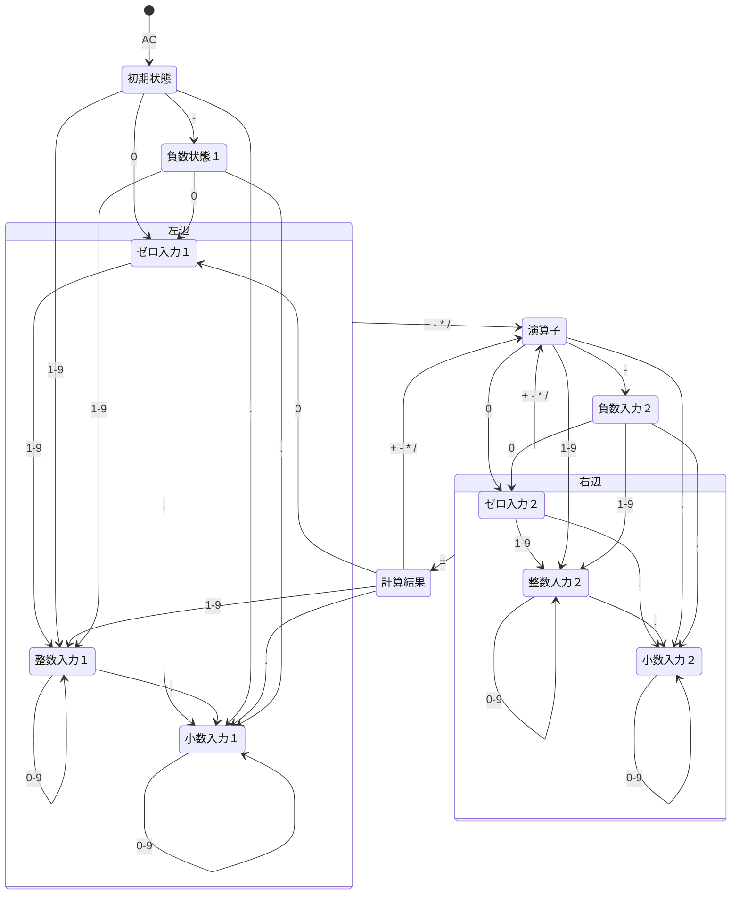

## 本項について

本項では設計の初回として、電卓の仕組みについて考えていきます。そのモデルとして、**ステートマシン**を参考に見ていきます。

## 電卓の仕組み

電卓は いくつものキーがありますが、押すタイミングで処理内容が変わります。

例えば、式が `1` の状況下で `+` を押せば、`1+` と式に演算子が加え入れられます。そして式 `1+` の状況下では、追加で `+` を入力することはできません。

一方、式 `1+1` に `+` を入力した場合、式は `2+` になります。これはすでにある `1+1` を計算した結果 `2` に対し、演算子 `+` が入力された状態を意味します。

この内容をまとめると、下表のようになります。

|式|入力|結果|備考|
|:---:|:---:|:---:|:---|
|`1`|`+`|`1+`|演算子として入力|
|`1+`|`+`|(`1+`)|演算子の後ろに演算子は入力不可|
|`1+1`|`+`|`2+`|一度計算処理した後、演算子として入力|

このように `+` １つとっても、式の**状況によって**「単なる演算子として加える」「入力できない」「既にある式を計算し、その演算子とする」といったように**処理内容が変化する**ようです。これを説明するのに便利なものが、**ステートマシン**という考え方です。

### ステートマシンとは？

ステートマシンの例として、（手元にあった）エアコンのリモコンを使って説明してみたいと思います。

- **起動前状態**では、「電源」ボタンと「タイマー」ボタンのみ受け付ける
  - 「電源」ボタンは、**入**と認識される
  - 「タイマー」ボタンは、**タイマー入**として認識される
  - 温度の上下ボタンを押しても**反応しない**
- **起動状態**では、様々なボタンが受け付けられる
  - 「電源」ボタンは、**切**と認識される
  - 「タイマー」ボタンは、**タイマー切**として認識される
  - 温度の上下ボタンで、**温度調整ができる**

このようにエアコンは *起動状態* や、冷房や暖房といった *運転内容* を**状態:ステート**として管理していると思われます。リモコンのボタン入力は、その状態に応じて「入/切」「タイマー入/タイマー切」といった内容に解釈されます。また、そのボタン入力で別の状態に遷移し、受け付ける入力内容やその解釈も変化することが考えられます。

### ステートマシンとしての電卓

上図は、電卓の大まかな**状態遷移図**になります。これは先程説明したステートマシンの、状態の移り変わりを図表にしたものです。

- `●` は、初期入力地点を表します
- 四角で囲まれたテキストは、**状態：ステート**です
- 状態から伸びる矢印は、状態が遷移することを表します
- 矢印横にある `0-9` などは、遷移する際の入力値です
- 例えば「初期状態」から `0-9` の入力があれば「左辺」へ、`-`なら「負数状態」へ遷移する、ということです
- 遷移の入力値以外は、不正な入力値です
- 例えば「初期状態」に `+, *, /` が入力されても、無効な入力として扱われます

「右辺」や「計算結果」からの状態遷移については、少し複雑になっているので追加で説明します。

#### 「右辺」→ `+,-,*,/` →「演算子」の流れ

「右辺」にいる際の式を `1+1` と仮定します。この時 `=` が入力されれば、計算を実行し式は `2` へと更新されます。この場合の状態は「計算結果」です。

では、式 `1+1` の「右辺」にいる状態で、演算子 `+` を入力したらどうなるでしょうか？

この場合、まず先に `1+1` の計算が実行され、式は `2` に更新されます。このタイミングでの状態は先程の考えから「計算結果」に位置していそうです。ただ、`+` 演算子の**意図としては、計算結果を使って更に計算を続ける**ものなので、状態としては「左辺」でもありえます。

そうなると「左辺」に演算子が入力されたものとなり、式としては `2+` 、状態は「演算子」へと遷移します。この一連の流れを簡略化して、上図での矢印は「右辺」から「演算子」へ直結させています。

#### 「計算結果」→ `0-9` →「左辺」の流れ

「計算結果」から「演算子」への流れについては、先程の「右辺」→「演算子」の流れと同じなので割愛します。なのでここでは「計算結果」から「左辺」へ状態遷移する流れについて説明します。

ここでは、式 `1+1` に `=` が入力され、計算結果 `2` が表示された状態を仮定します。

このタイミングで演算子が入力された場合、その意図は「計算結果を使って更に計算を行う」ものです。では数値が入力された場合、その意図とは何でしょうか？

この場合の**意図は、計算内容を破棄して新しく式を作成する**ものと考えるべきでしょう。「計算結果」で式 `2` に対し `9` が入力された場合は、「初期状態」から「左辺」へ遷移する流れと同じく、式は `9` となり、状態は「左辺」になります。

#### 電卓の挙動を再現した状態遷移図

大まかな状態遷移図は[上図](#ステートマシンとしての電卓)の通りですが、実際にはもう少し細かくなります。例えば「右辺」「左辺」の状態は、中身は整数だったり小数だったりするので、下図のような形を取ります。

「整数入力」「小数入力」にある、**自身へと戻る矢印は、入力は有効だが状態は変化しない**ことを意味しています。例えば「小数入力」状態で式が `0.12` の場合、そこに数値（ここでは `3` とします）が入力されても、式が `0.123` になるだけで状態は「小数入力」からは変化しません。

こうしたものを全て取りまとめたものが、下図になります（`mermaid` のダイアグラム的に無理がある内容なのか、少し見づらいことをご了承ください）

上図での「状態」について、その時の式の例を表したのが下表になります。

|状態名|式の例|
|:---|:---|
|初期状態|（なし）|
|負数状態１|`-`|
|左辺ゼロ入力|`0`, `-0`|
|左辺整数入力|`1`, `123`, `-1`|
|左辺小数入力|`0.`, `0.1`, `-1.23`|
|演算子|`1+`, `-1-`, `0.12*`|
|負数入力２|`1+-`, `10--`, `-0.12--`|
|右辺ゼロ入力|`1+0`, `1+-0`|
|右辺整数入力|`1+1`, `1+123`, `1+-12`|
|右辺小数入力|`1+0.`, `1*0.1`, `1--1.23`|
|計算結果|`2`|

**状態**と**入力可能な値**、**入力後に遷移する状態**をまとめたものが、下表になります。列見出しで「状態名」、行見出しで「入力値」を表し、その交点にあるセルは「その状態で入力が為された場合、次に遷移する状態名」を表します。

| 状態名 / 取りうる値 | 0 | 1-9 | . | - | +, *, / | = |
|----------------------|---|-----|---|---|---------------|---|
| 初期状態 | 左辺ゼロ入力 | 左辺整数入力 | 左辺小数入力 | 負数状態１ | - | - |
| 負数状態１ | 左辺ゼロ入力 | 左辺整数入力 | 左辺小数入力 | - | - | - |
| 左辺ゼロ入力 | - | 左辺整数入力 | 左辺小数入力 | 演算子 | 演算子 | - |
| 左辺整数入力 | 左辺整数入力 | 左辺整数入力 | 左辺小数入力１ | 演算子 | 演算子 | - |
| 左辺小数入力 | 左辺小数入力 | 左辺小数入力 | - | 演算子 | 演算子 | - |
| 演算子 | 右辺ゼロ入力 | 右辺整数入力 | 右辺小数入力 | 負数入力２ | - | - |
| 負数入力２ | 右辺ゼロ入力 | 右辺整数入力 | 右辺小数入力 | - | - | - |
| 右辺ゼロ入力 | - | 右辺整数入力 | 右辺小数入力 | 演算子(*) | 演算子(*) | 計算結果 |
| 右辺整数入力 | 右辺整数入力 | 右辺整数入力 | 右辺小数入力 | 演算子(*) | 演算子(*) | 計算結果 |
| 右辺小数入力 | 右辺小数入力 | 右辺小数入力 | - | 演算子(*) | 演算子(*) | 計算結果 |
| 計算結果 | 左辺ゼロ入力 | 左辺整数入力 | 左辺小数入力 | 演算子 | 演算子 | - |

(*): 一度 計算結果 を経由して 演算子 に遷移する

:::message

応用として、上記 11 個の状態の他に 計算値 `Infinity`, `Not a Number` を踏まえた**エラー状態**を含めることができます。これは後ほど解説するゼロ除算（１÷０ など）に対応させるためのものです。

:::
