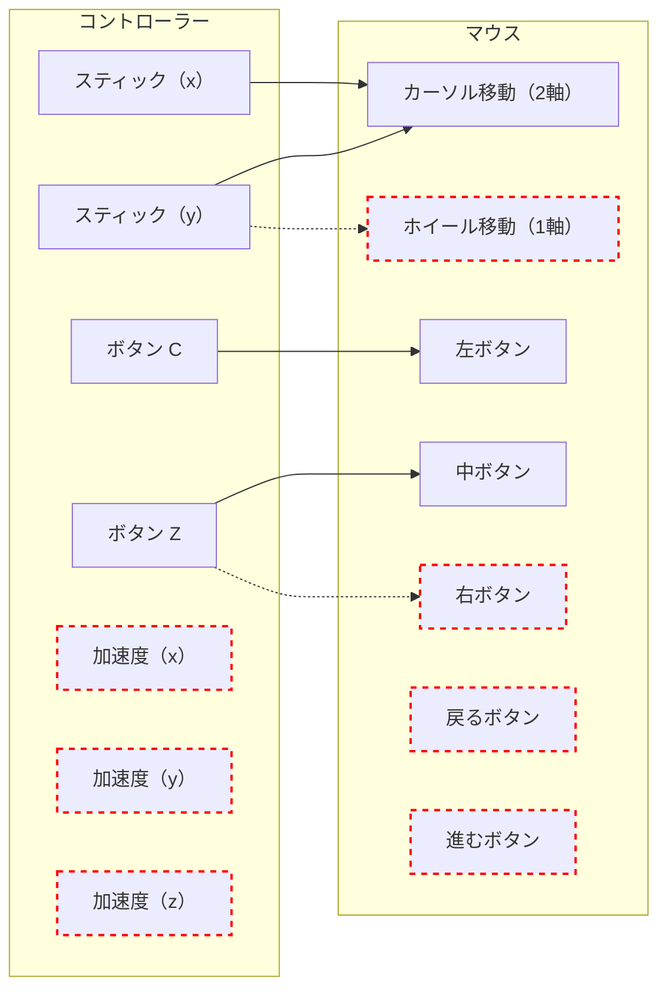

## はじめに

ここでは、コントローラーとマウスを組み合わせた場合に、どのような問題が生じるかを取り上げ、考えていきます。

## 両者を組み合わせることの問題点

物理機器（コントローラ）とソフト機器（マウス）を組み合わせた際に生じる問題とは、端的に言えば下記の 2 つです。

1. 加速度情報の扱いづらさ
2. 物理機器の機能不足

### 加速度情報の扱い

まず第一に、**加速度センサーから得られるデータを どう使うか**という問題があります。

#### 扱える情報について

ゲームでの利用法から考えてみると、加速度情報の利用先として 主に 2 つが挙げられます。

- 振る
- 傾ける（向き）

##### 振る

よく見られるのは「振る」というアクションでしょう。コントローラに搭載された加速度センサーは、勢いよく振った際の運動エネルギーを検知します。

ゲームでは加速度情報の急激な変化を検知し、剣撃を出したり、ラケットを振るなどのアクションを行います。

このように、**瞬間的な運動量を検知**して何か処理を行う、といった使い方が考えられます。

##### 傾ける

また、「傾ける」動作というのもあったと思います。これは重力方向にかかるエネルギーを加速度センサーが検知しており、そこからデバイスの向きを計算することができるからです。

ゲームだと、例えば釣り竿に見立てて、竿の向きや動きを画面上に投影することができます。

:::message

加速度情報がデバイス向きを計算できる例としてわかりやすいのは、フィットネス系のゲームです。

（Switch での話になりますが、例えば）リングフィットアドベンチャーというゲームを取り上げます。開始時の器具装着 確認画面でコントローラーの状態を画面上に投影していますが、恐らくこの情報を使ってデバイスの向きを投影しているのだと考えられます。

:::

このように**デバイスの傾き、あるいは向きを検知**して何か処理を行う、といった使い方も考えられるでしょう。

#### 誤差について

コントローラーの加速度情報は 誤差が結構大きく、± 10％ 程度と考えられます。

そのため、仮に何かしらで使うにしても、精密な動きを前提とした使い方は あまり現実的ではありません。

#### マウス機能として扱う際の困難

ここまでに挙げた「扱える情報」と「誤差の大きさ」という要素が、加速度情報をマウス機能にあてがうことを困難にしています。

マウス機能として必要な要素は、下記になります。

- カーソル移動
- ホイールスクロール
- マウスボタン（左右中）
  - クリック
  - ダブルクリック
  - ドラッグ
- 戻る、進むボタン

これらに対し、加速度情報（振る、傾ける）をどこに割り当てられるかを考えてみます。

##### 振る動作を割り当てる

まず、「振る」という動作は割り当てることは難しいでしょう。

マウスボタンではダブルクリックやドラッグ操作ができませんし、クリックする度にコントローラーを振るというのは現実的ではありません。

またカーソルやホイールに関しても、直感的ではありません。

##### 傾ける動作を割り当てる

次に「傾ける（向き）」動作ですが、これも（直接的には）難しいでしょう。

まず割り当て先として考えられるのはカーソル移動です。確かに、動かしたい向きに傾けることでカーソルを移動させるのは、直感的ではあります。

しかしマウスカーソルは**動かさない**という動作（？）が必要不可欠です。

例えばリンクテキストをクリックするためには、カーソルを目的位置に移動した後、ある程度その位置を保持し続ける必要があります。

加速度情報をカーソルに割り当てた場合、動かさないためには同じ姿勢を保持し続ける必要があります。この「同じ姿勢を保持し続ける」というのは、結構負担がかかります。

またデータの誤差が大きいことから、実際には静止していてもカーソルは動いてしまうということも往々にして考えられます。

### 物理機能の不足

両方を組み合わせる問題点の 2 つ目としては、コントローラーとマウスとで機能数が非対称である点です。

まず マウス（今回は 5 ボタンマウスを想定）ですが、下記の機能が必要となります。

- カーソル移動（`x`, `y` の 2 軸）
- 各種ボタン（押下/解放管理）
  - 左ボタン
  - 右ボタン
  - 中クリック
- ホイール操作（ 1 軸）
- 戻るボタン
- 進むボタン

一方 今回扱うコントローラーは、下記のデータを扱えます。

- C ボタン
- Z ボタン
- スティック（`x`, `y` の 2 軸）
- 加速度（`x`, `y`, `z` の 3 軸）

ここで前述した「加速度情報は扱いづらい」という点から、加速度のデータは割り当てないようにします。

その上で、上記で出揃った内容を単純に結びつけてみます。結果は下図のようになります。

ここからわかることは、マウスとして必要となる機能に対し、**コントローラーで割り当てられる物理機能の数が少ない**ということです。

- 物理ボタン 2 つに対し、必要なマウスボタンの機能は 5 つ（左右中 + 戻る/進む）
- スティックをカーソル移動に割り当てると、ホイールには使えない
- ホイールは 1 軸情報なので、物理機能に割り当てるならスティック（`x`, `y`）どちらか、もしくは 2 ボタン必要

:::details 個人メモ：単純な入力でなく組み合わせ入力という考え

リポジトリでは別の手法を取りましたが、**組み合わせによる入力**という考えもあるかもしれません。

ここでいう「組み合わせ」とは、例えば「◯ボタン ＋ スティック ＝ 操作 A」といった形式を指しています。例を 1 つ挙げると、単純に C ボタンを押した場合はマウス左ボタンとして扱う一方、Z ボタンを押し続けた状態で C ボタンを押した場合は 中央ボタンになる、といった具合です。

ただしこれには複数の問題があったため、今回は見送ることになりました。

1. 操作が複雑になるため、覚えづらく、高度な手指の巧緻性が必要となる
2. 恐らく機能数としては、それでも不足してしまう
3. スティックをマウスボタン等に割り当てる方法も考えられるが、そうすると今度はドラッグ操作ができなくなる可能性がある

:::

## まとめ

本項では、コントローラーとマウスを組み合わせた際に生じる問題について考えました。

1. 加速度情報の扱いづらさ
2. 物理機器の機能不足

次項では、これらの問題に対処案を考えていきます。そして本リポジトリでの解決案である「モード切替」について説明します。
