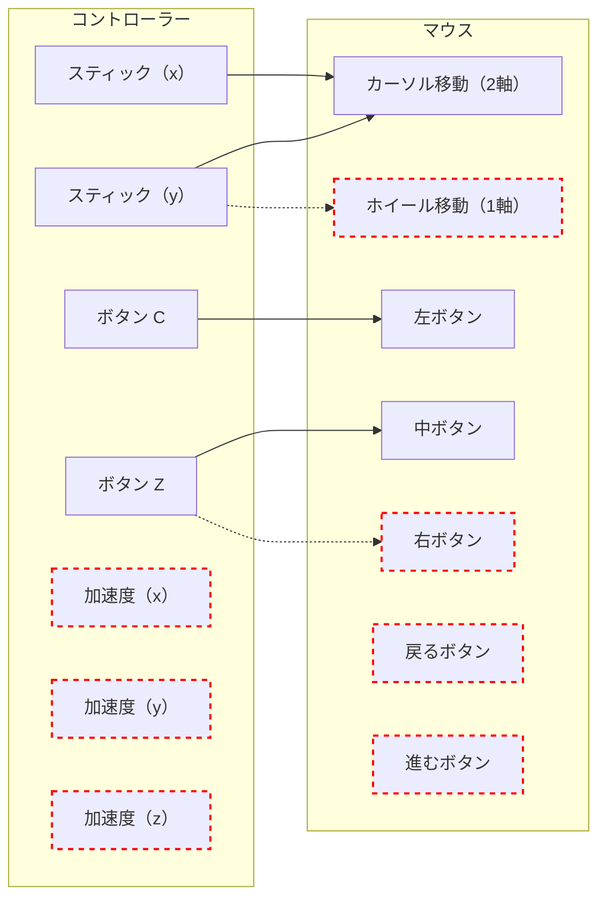
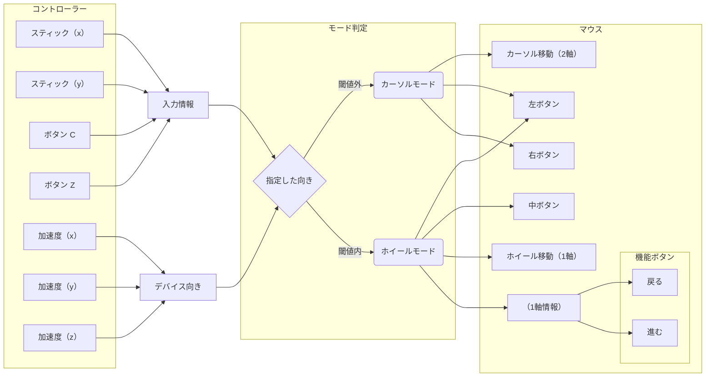

## はじめに

ここでは[前項](./230__problems-with-combining)の問題に対して、解決案を考えていきます。

本項では解決案の 1 つである**モード切替**という考え方を取り上げ、どのようにして実装していくかを考えていきます。

## モードという考え方

前項挙げられた問題点は、**マウス機能として必要な機能数に対し、コントローラーの機能数が少ない**ということでした。言い換えれば、**マウスとコントローラーの機能を 1 対 1 で結びつけることができない**、ということです。

そこで不足するコントローラー側の機能に、複数の役割を担わせることで この問題を解決します。そのために必要なのが、**モード**という考え方です。

例えば「A モード」と「B モード」の 2 つを用い、コントローラーの **C ボタン**を下記のように取り扱うようします。

- **A モード**では、マウス**左ボタン**として取り扱う
- **B モード**では、マウス**右ボタン**として取り扱う

これでコントローラーのボタンに 2 つのマウス機能を割り当てることができました。同じ要領で他のコントローラーにも割り当てれば、不足していた機能を充足できるというのが、モードの考えです。

### モード切替の判定をどうするか

では、この「A モード」と「B モード」を**どのように切り替えるか**を考えてみます。案としては、**特定の物理機能をモード切替に割り当てる**ことが考えられます。

### 案１：Zボタン

案の 1 つ目としては、Zボタンを使うことです。ボタンを押し続ける、あるいはトグルスイッチのように扱い、モード管理に割り当てます。

その場合の挙動としては、例えば下記のようになるでしょう。

- Zボタンを押した状態（≒ A モード）
  - C ボタンは、マウス左ボタン
  - スティックはカーソル移動（X,Y方向）
- Zボタンを離した状態（≒ B モード）
  - C ボタンは、マウス右ボタン
  - スティック（Y 軸方向）はホイールスクロール
  - スティック（X 軸方向）は戻る/進むボタン（右：戻るボタン、左：進むボタン）

「[モードという考え方](#モードという考え方)」で挙げた図から、ホイール操作と戻る/進むボタンを充足することができました。

ただし、これでも機能数としては 1 つ（マウス中ボタン）不足している状態です。これはコントローラーの物理機能数が少ないという中で、Z ボタンをモード切替に占有してしまっているからです。

そのため、**既存のコントローラー割当を潰さないようにする必要**があります。

### 案２：加速度

そこで案の 2 つ目として、加速度情報を使うことを考えてみます。

これは案 1 にて *既存のコントローラーの機能を潰せないこと* がわかったため、「利用していなかった加速度情報をモード切替に利用できないか？」という点から出発しています。

ただしセンサーの計測誤差の大きさを鑑み、細かな挙動は前提としないようにします。ここでは「デバイスが特定の向き（例：立てた状態）か？」という単純な条件をモード切替に使うことにします。

挙動としては、例えば下記のようになるでしょう。

- 通常位置（≒ A モード）
  - C ボタンはマウス左ボタン
  - Z ボタンはマウス右ボタン
  - スティックはカーソル移動（X,Y方向）
- コントローラーを立てた状態（≒ B モード）
  - C ボタンはマウス左ボタン
  - Z ボタンはマウス中ボタン
  - スティック（Y 軸方向）はホイールスクロール
  - スティック（X 軸方向）は戻る/進むボタン（右：戻るボタン、左：進むボタン）

案１に対し、Z ボタンの空き（2 モード分）をマウス機能に割り当てることができるようになりました。その結果、C ボタンをマウス左ボタンに固定した状態で 全てのマウス機能を充足することができています。

:::message

懸念点としては、捻る動作が入ることになるので、ある程度の手指の巧緻性が必要になってくることです。ただしこの問題は、ある程度 解消する余地もありそうです。

例えば「モード変更の方向（上下左右前後）」と「角度許容のマージン」をパラメータとして用意し、ユーザーが設定可能な形にしておくといった方法です。

:::

## まとめ

本項では、[前項](./230__problems-with-combining)の問題である下記に対して、モード切替という解決案を提示しました。

1. 加速度情報の扱いづらさ
2. 物理機器の機能不足

次項では、マウスとして利用する際に考えなければならない、パラメータ調整について説明します。
