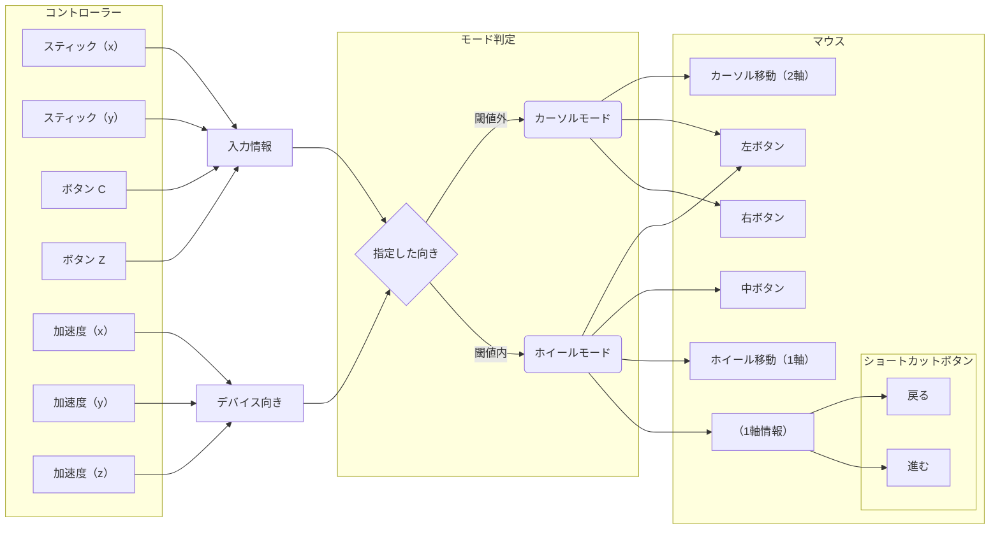
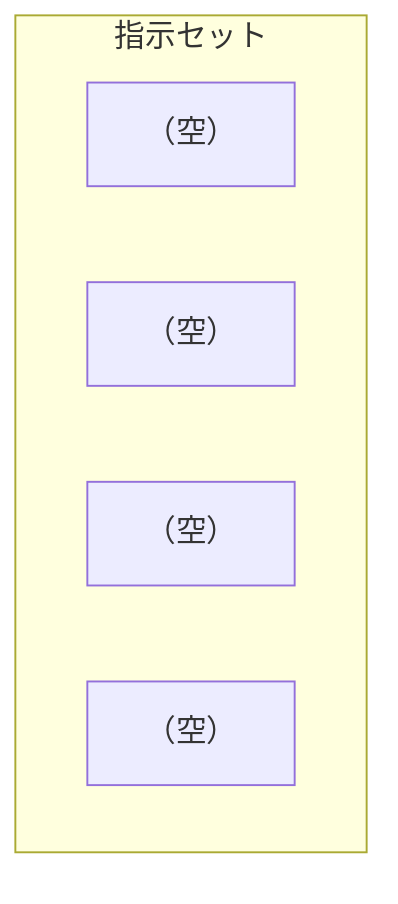
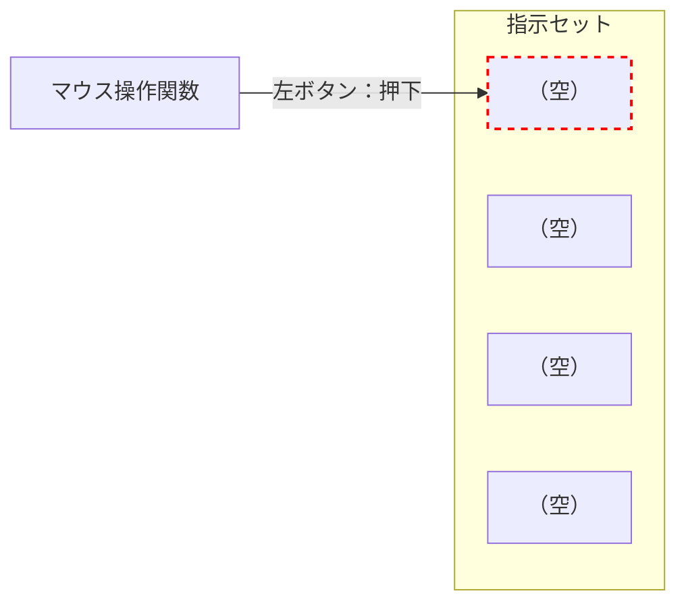
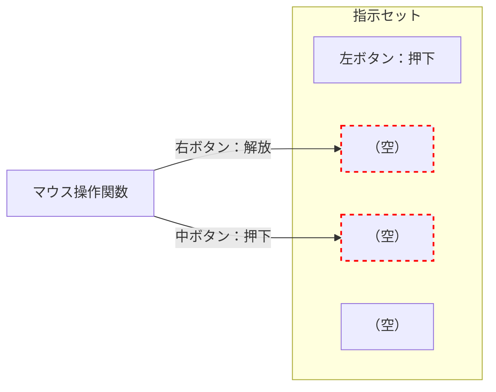
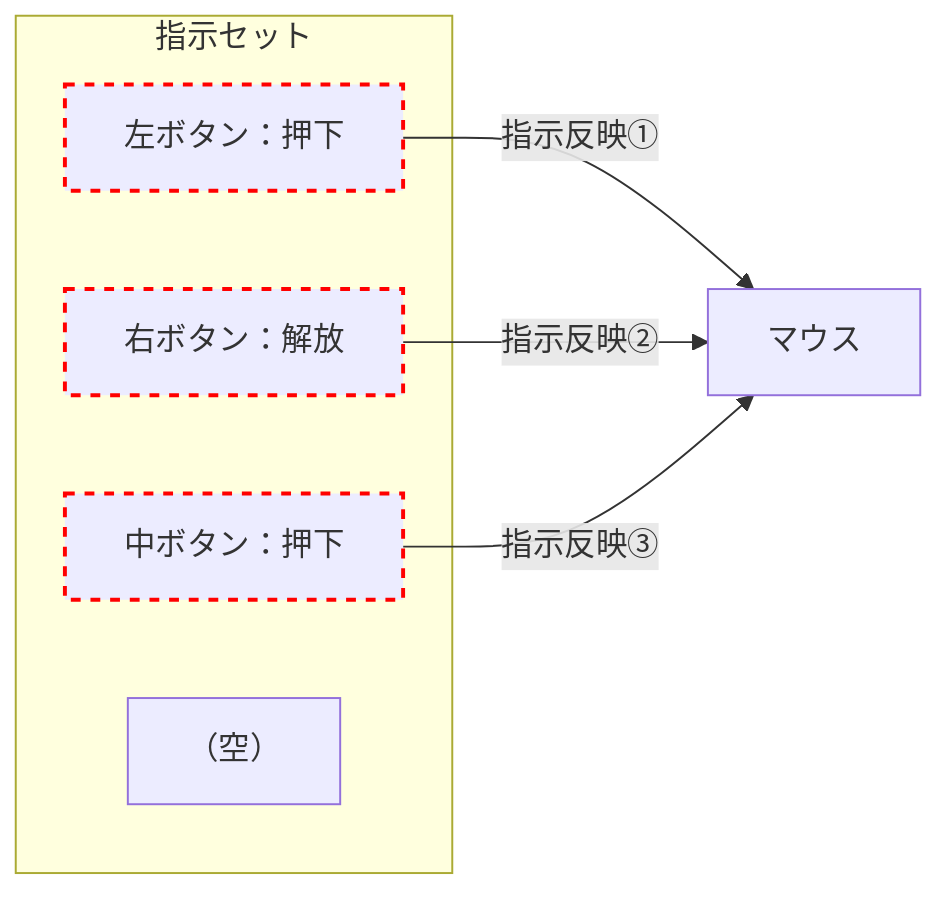

## はじめに

本項では、最終的な反映先であるマウス操作について考え、それを管理するための構造体を作成します。

## マウス操作を管理するために

ここまでのコードで、コントローラーから各種データを取得することができました。これらを使って、マウス機能の実装をしていくことになります。

- スティック（2軸）
- ボタン（2種）
- 加速度（3軸、利用しやすいよう平滑化処理）

:::message

「[📄設計：両者を組み合わせた場合の問題点](./230__problems-with-combining)」にて、**マウス機能に対して物理機能の数が少ないという問題点**がありました。

これは次項の「[📄設計：解決案としてのモード切替](./240__switch-mode-as-solution)」にて、モード切替の考えを使い、1 つの物理機能に複数の役割を持たせる方法で解決することになっています。

:::

ここではコードに起こす前段階として、どのような構造で管理していくかを考えていきます。

### モード切替のおさらい

「[📄設計：解決案としてのモード切替](./240__switch-mode-as-solution)」の内容のおさらいになりますが、コントローラーからの入力情報を どのようにマウス操作に反映するかを確認します。

これは、加速度情報を使ったデバイスの傾きをモード切替の判定として使い、「カーソルモード」と「ホイールモード」の 2 つを切り替えることで実装する事になっています。

- カーソルモード（通常位置）
  - C ボタンはマウス左ボタン
  - Z ボタンはマウス右ボタン
  - スティックはカーソル移動（X,Y方向）
- ホイールモード（デフォルト設定では *Pitch Up*）
  - C ボタンはマウス左ボタン
  - Z ボタンはマウス中ボタン
  - スティック（Y 軸方向）はホイールスクロール
  - スティック（X 軸方向）は戻る/進むボタン（右：戻るボタン、左：進むボタン）



### マウス操作に必要なデータ

上記より まず、マウス操作の管理に必要なデータは下記になることが考えられます。

- カーソル移動量（2軸）
- ホイール移動量（1軸）

これらは割と簡単に実装することができますが、下記のボタンに関するデータは、扱いが少し複雑になってきます。

- マウスボタン（左右中）
- ショートカットボタン（戻る/進む）

#### マウスボタンの管理

マウスボタンの管理がカーソル・ホイールに比べて複雑になる理由は、時間軸上の**状態管理が必要**になるためです。

下記は、現状で作成できている `loop` 関数です。イメージとして、この処理が **1 フレーム**（≒ 1/60 秒）**単位で実行される**と考えてください。

```cpp:現在のloop関数
// セットアップ後、常時処理される関数
void loop() {
  if(isNunchukConnected){
    // コントローラーから入力を読み取る（正常に読み取れたかで分岐）
    if(readNunchuk(nunchukInput)){
      // 加速度を平滑化処理する
      smoothAccelerometer(smoothedAccel, nunchukInput.accelX, nunchukInput.accelY, nunchukInput.accelZ);

      // 1. コントローラーから取得した各種データを、マウス操作に変換
      // 2. マウス操作を実行

    } else {
      // 省略：読み取り失敗時の処理
    }
  } else {
    // 省略：エラー時（未接続・通信断）の処理
  }
  delay(MOUSE_DELAY);
}
```

カーソルやホイール操作に関しては、1 フレーム単位で取得される入力値を そのままマウス操作として反映させれば済むので簡単です。

一方でマウスボタンに関しては、1 フレーム単位で「押した」「離した」をマウス操作として反映するものではありません。「マウスボタンを**押し続ける**」という動作は、マウスボタンを**秒間 60 回で押した**とは異なるのです。

##### 状態管理によるマウスボタン操作

マウスボタンに関する機能は、**状態管理**を使うことになります。

「マウスボタンをクリック」という動作は、マウスボタンの「押下」「解放」がセットとなったものです。この**押下/解放**という状態を、時間軸上で管理することになります。

例として、「左マウスボタンの押下」という処理を行なったとしましょう。この処理によって、左マウスボタンは**押下状態**になりました。

以降 何もしない場合、左マウスボタンは**押下状態**のままです。都度 押下の処理をするまでもなく、一度押下状態になったものは「解放」の処理を明示するまでずっと押下状態です。

押下状態にある中で「左マウスボタンを解放」という処理を行なった場合、左マウスボタンは**解放状態**になります。これも「押下状態」と同じで、以降何もしなければずっと解放状態を維持します。

ここからわかることは、**マウスボタンの状態（押下/解放）は時間軸上で管理されている**ということです。

##### ボタン状態をデータ上で管理

上記から、**マウスボタンの管理には時間軸上で状態管理する必要がある**ことがわかりました。

これはつまり、`loop` 関数で取得した物理ボタンの入力（状態）に加え、**1 つ前の物理ボタン状態**が必要になるということです。**直近の物理ボタン状態と現在の状態を見比べて、そこに変化（押下→解放、あるいはその逆）があれば、それをマウス操作として反映する**というのが、マウスボタンの一連の流れとなります。  
（逆に言えば、変化がなければマウスボタンに関する一切の処理は行われない、ということです）

#### ショートカットボタンの管理

ショートカットボタンの管理がカーソル・ホイールに比べて複雑になる理由は、**一度機能を実行した際に、一定の待機時間が必要なところ**にあります。

「[マウスボタンの管理](#マウスボタンの管理) 」で述べたように、**Arduino は 1 フレーム単位で入力状況を読み取り、マウス操作として反映するもの**とイメージしてください。ショートカットボタンを押していた場合には その内容をもとに「戻る（または 進む）」機能を実行するわけです。

当たり前ですが、ユーザーに対して「ボタンを押して離すといった動作を 1 フレームで完結させる」ことはできません。どうしても一定期間の入力状態が生じるわけですので、**何も対策しなければ入力時間分のショートカットボタンの処理が行われる**ことになります。これはユーザーの意図している操作に反します。

##### 待機時間の設定

そのため、**一度ショートカットボタンが発動した際、一定期間 入力を無効化する**処理が必要になります。

### モード切替とマウスボタンを組み合わせた際の問題点

「[マウスボタンの管理](#マウスボタンの管理)」にて、マウスボタンの管理は単純なオンオフの管理ではなく、時間軸上での変化を状態管理する必要があることがわかりました。そこでは、直近と現在の物理ボタン状態を見比べて、変化があるかで押下/解放状態を切り替えるといったものになります。

それ自体は特に問題はありません。下記のように 現在と直近という 2種を変数として管理すればいいだけの話です。物理ボタンは C, Z の 2 種あるので配列を使いますが、言ってしまえばそれだけです。

```cpp:C,Zボタンを状態管理
bool buttonStatesCurrent[2] = {false, false};  // 現在のボタン状態（押下/解放）
bool buttonStatesLast[2] = {false, false};  // 直近のボタン状態（押下/解放）

// ループ内での処理手順の例
// 1. 現在のボタン状態を `buttonStatesCurrent` に反映
// 2. `buttonStatesLast` と比べ、変化があるかを判定
// 3. 変化があればマウスボタンの処理、なければそのまま
// 4. `buttonStateCurrent` の内容を `buttonStatesLast` に移行
// （以降は、再度 手順 1 に戻って繰り返すといった流れ）
```

ですが、ここに**モード切替**の考えが加わると、事態が複雑になってきます。

#### モード切替時のマウスボタンの挙動について

そもそもモード切替を用意した理由は、「2 つのボタンではマウスボタン（左右中）を実装できない」ためでした。なのでコントローラーにある物理ボタン（C, Z）の役割は、カーソル ↔ ホイール のモード間で変化することが想定されます。

例として Z ボタンを「カーソルモード時は **マウス右ボタン**に、ホイールモード時は **マウス中ボタン**に」割り当てるとします。

ここで問題となるのは、「**カーソルモードの状態で Z ボタンを押し続け、そのままホイールモードに移行した際、マウスボタンはどのように処理されるか**」です。

マウス右ボタンは押下状態ですが、ホイールモードに移行してしまうと Z ボタンの役割が マウス中ボタンに変化してしまいます。その場合、どのタイミングでマウス右ボタンを解放状態にすべきかを考えなければなりません。

##### 本リポジトリでの挙動について

本リポジトリでは、**物理ボタンに複数の役割が割り当てられており、押下状態でモード切替を行なった場合**は、下記のように処理するものと定義します。

- 旧モード時のマウスボタンは解放状態にする
- 新モード時のマウスボタンは押下状態にする

これは旧モード時の押下状態を維持し続けることは、ユーザーの想定から外れるためです。

:::message

なお、モード切替でマウスボタンとしての役割に変化がない場合（例：カーソル・ホイールモード間で同じマウス左ボタンを割り当て）は、これには該当しないものとします。

:::

#### 1回の処理内で行われるマウス操作の数について

上記より、`loop` 関数 1 回の処理に対して、**マウスボタン処理を行う可能性のある最大回数**は いくつになるでしょうか？

可能性としては、**最大で 4 つ**が考えられます。

##### ケース例

現実的ではありませんが、C ボタンに「マウス左ボタン ↔ マウス右ボタン」、Z ボタンに「マウス中ボタン ↔ マウス左ボタン」といった具合に、お互い違う役割を持たせる状況を想定します。

その状況で、両ボタンを押した状態でモードを切り替えた場合、下記の 4 つの処理が生じることになります。

1. マウス左ボタンの解放（C）
2. マウス右ボタンの押下（C）
3. マウス中ボタンの解放（Z）
4. マウス左ボタンの押下（C）

:::message

上記ではマウス左ボタンを解放して再度押下するという歪な形になっていますが、「[本リポジトリでの挙動について](#本リポジトリでの挙動について)」で述べた挙動を機械的に当てはめると このようになります。

実情を考えるに「両ボタンの別モードに 1 つの役割を割り当てる」といったことは想定としてあまり考えておらず、このケースはあくまで「理論上可能な挙動」での話になります。

:::

#### 関数としての役割分担

最後に 上記とはあまり関係ありませんが、マウスボタン等の操作をどこで処理するかの問題があります。

デバッグモードの実装を踏まえると、**マウス操作に関する管理**と**実際の処理**は分けて考えたいです。「マウスをどのように操作するか」を 1 つの関数内で完結させておけば、デバッグモードのオンオフで挙動を切り替えることが容易になります。

- オン（≒ デバッグモード）では、マウス操作情報を**モニタに表示**する
- オフでは、マウス操作情報を**実際の処理として反映**する

そのためには、下記の 3 つの関数が必要となります。

1. 「マウスをどのように操作するか」を判断・処理し、構造体等で管理させる
2. 1 番の情報を引き出し、デバッグ用に処理内容を表示させる
3. 1 番の情報を引き出し、実際のマウス操作に反映させる

### マウスボタン処理をバッファ管理

[先程](#モード切替とマウスボタンを組み合わせた際の問題点)述べたように、モード切替とマウスボタンを組み合わせる場合には いくつかの問題点があります。今回はそれを、途中で生じたボタン処理をバッファに貯めておくといった方法で解決していきます。

- 指示セットを定義し、複数格納できるよう配列を定義する
  - これは、**マウスボタン**（左右中）と**処理**（押下/解放）のセットで構成される
- 指示セット用の配列には、1 回の `loop` 処理内で**最大 4 つまで貯めておける**
  - 4 つなのは[理論上の最大回数](#1回の処理内で行われるマウス操作の数について)であるため
- 物理ボタンに変化があった場合は、いきなりマウス操作をするのでなく、一旦指示セットの配列に貯めておく
- 全ての工程が終わり、マウス操作の反映のみになったタイミングで、指示セット配列から 1 つずつ取り出し、操作として反映
- `loop` 内の処理が完了したら、指示セット配列は全て削除する（≒ 次の `loop` で再度 1 から貯め直す）

#### １回あたりの処理の流れ

1 回の `loop` 処理に対する大まかな流れを説明します。

指示セットを格納するための配列（要素数 4）があります。`loop` 処理開始の時点で、初期化をかけて空の状態にしておきます。



ここから、コントローラーからデータを読み出し、それをマウス操作に反映します。その際、マウスボタンに関する操作は直接処理するのでなく、「指示セット」という形で一旦 配列に格納しておきます。



他にマウスボタン関連の処理が生じた場合も同様に、配列内に指示セットを格納します。



`loop` 処理の最後の段階で、実際のマウス操作へと反映します。指示セットの中身を順に取り出し、マウス操作として反映します。



これで `loop` 処理での一連の流れが完了となります。

再度 `loop` 処理に映る場合は、[本段落の最初](#１回あたりの処理の流れ)に戻り、配列を初期化して再度指示セットを格納していく、といった流れになります。

## 構造体の設計

今回関係してくる設定項目は、下表の 1 つです。

|定数名|型|内容|
|---|---|:---|
|`SHORTCUT_WAIT_TIME`|`int`|ショートカット入力の待機時間|

### 構造体の定義

構造体名を `MouseControl` とし、この中に諸々を管理していくようにします。

```cpp:構造体の定義
// マウスの状態を管理する構造体
struct MouseControl {
  // - 現行モード
  // - カーソル移動量（2軸）
  // - ホイール移動量（1軸）
  // - ショートカットボタン用（1軸）
  // - ショートカットボタンの待機時間
  // - 直近の物理ボタン状態（2種）
  // - 現在の物理ボタン状態（2種）
  // - マウスボタン指示関係
};

// インスタンスの生成
MouseControl mouseControl;
```

### モード管理

次に現行モードをこの中で管理します。モードに関しては、前項で `define` を使って定義したものを使います。

```cpp:モード定義
#define MODE_CURSOR 0
#define MODE_WHEEL 1
```

```cpp:モード管理
// マウスの状態を管理する構造体
struct MouseControl {
  int currentMode = MODE_CURSOR;  // 現在のモード

  // - カーソル移動量（2軸）
  // - ホイール移動量（1軸）
  // - ショートカットボタン用（1軸）
  // - ショートカットボタンの待機時間
  // - 直近の物理ボタン状態（2種）
  // - 現在の物理ボタン状態（2種）
  // - マウスボタン指示関係
}
```

### スティック情報の管理

次にカーソルやホイールに関する情報を定義していきます。

これらはスティックから取得される情報を、適切な形に変換した上で格納することになります。また ショートカットボタンの待機時間も、ここで管理することになります。

```cpp:スティック関係の管理
// マウスの状態を管理する構造体
struct MouseControl {
  int currentMode = MODE_CURSOR;  // 現在のモード

  // カーソルモード時のスティック関係
  int moveX = 0, moveY = 0;  // カーソル移動量（スティックの値を利用）

  // ホイールモード時のスティック関係
  int moveW = 0;  // ホイール移動量（※ スティックの Y 値を利用）
  int moveS = 0;  // ショートカットボタン用（※ スティック X 値を利用）
  int shortcutThrottling = 0;  // ショートカットボタン（進む、戻る）のスロットル用

  // - 直近の物理ボタン状態（2種）
  // - 現在の物理ボタン状態（2種）
  // - マウスボタン指示関係
}
```

#### ショートカット機能について

本リポジトリでは「戻る」「進む」機能を実装していますが、内部的な話をするとショートカットキー（例：Windown の場合、`Alt` + `↔`）を走らせています。

これの管理に必要なのが、「戻る」「進む」どちらかを判定する `moveS` と、一定の待機時間を生じさせる `shortcutThrottling` です。

##### `moveS`

`moveS`（*move Shortcut*: ショートカットボタン用）は、他の移動量関係のデータと同じように、スティック X 軸の傾きを数値で管理します。

数値は 0 中心のプラスマイナス方向に変化するものなので、符号によって左右（戻る/進む）を検知します。

##### `shortcutThrottling`

`shortcutThrottling` はショートカットボタンの待機時間を管理する変数です。

ショートカット操作は、これが 0 の状態時のみ機能するように設計します。そして一度処理を発動した場合、設定項目 `SHORTCUT_WAIT_TIME` の数値に設定し、以降 `loop` 関数を処理する度に 1 漸減させていきます。

つまり、再度ショートカット操作を行うためには、規定回数分 `loop` 関数を処理する必要があるということです。

### 物理ボタンの管理

次に、物理ボタン（C, Z）の状態を定義します。

これは「[モード切替とマウスボタンを組み合わせた際の問題点](#モード切替とマウスボタンを組み合わせた際の問題点)」で説明したように、ボタン状況を管理する配列を 直近と現在の 2 種類用意すれば OK です。

```cpp:C,Zボタンを状態管理
bool buttonStatesCurrent[2] = {false, false};  // 現在のボタン状態（押下/解放）
bool buttonStatesLast[2] = {false, false};  // 直近のボタン状態（押下/解放）

// ループ内での処理手順の例
// 1. 現在のボタン状態を `buttonStatesCurrent` に反映
// 2. `buttonStatesLast` と比べ、変化があるかを判定
// 3. 変化があればマウスボタンの処理、なければそのまま
// 4. `buttonStateCurrent` の内容を `buttonStatesLast` に移行
// （以降は、再度 手順 1 に戻って繰り返すといった流れ）
```

それぞれの配列において、**0 番目の要素が ボタン C**、**1 番目の要素が ボタン Z** に対応するものとします。このあたりは今後様々な箇所で扱うため、ボタン数含め定数として定義しておくことにします。

```cpp:定数として定義
const int BUTTON_C = 0;
const int BUTTON_Z = 1;
const int NUM_BUTTONS = 2;
```

上記を踏まえ、構造体内に物理ボタン状態を定義します。

```cpp:物理ボタンの管理
// マウスの状態を管理する構造体
struct MouseControl {
  int currentMode = MODE_CURSOR;  // 現在のモード

  // カーソルモード時のスティック関係
  int moveX = 0, moveY = 0;  // カーソル移動量（スティックの値を利用）

  // ホイールモード時のスティック関係
  int moveW = 0;  // ホイール移動量（※ スティックの Y 値を利用）
  int moveS = 0;  // ショートカットボタン用（※ スティック X 値を利用）
  int shortcutThrottling = 0;  // ショートカットボタン（進む、戻る）のスロットル用

  // ボタン状態
  bool buttonStatesCurrent[NUM_BUTTONS] = {false, false};  // 現在のボタン状態（押下/解放）
  bool buttonStatesLast[NUM_BUTTONS] = {false, false};  // 直近のボタン状態（押下/解放）

  // - マウスボタン指示関係
}
```

### マウスボタン操作指示の管理

最後は、マウスボタン指示関係の定義になります。ここでは「[マウスボタン処理をバッファ管理](#マウスボタン処理をバッファ管理)」で説明した形での実装を行なっていきます。

#### マウスボタン指示セットの定義

まずは指示セットを構造体として定義します。これは「マウスボタン（左右中）」と「処理（押下/解放）」の 2 つで構成されるものです。

はじめに、「処理」を定義します。これは例えば数値を使って管理（例： `0` -> 未定義, `1` -> 押下, `2` -> 解放）もできますが、コードを作成するに当たっては何をしているのかわかりづらくなります。

そのため、列挙体を使った定義を行います。

```cpp:処理内容を列挙体で定義
// マウス操作での処理情報（未定義、押下、解放）
enum MouseActionType { ACTION_NONE, ACTION_PRESS, ACTION_RELEASE };
```

上記の列挙体を含め、指示セットを構築します。マウスボタンですが、`Mouse` ライブラリでは `MOUSE_LEFT`, `MOUSE_RIGHT` といった表現を使いますが、内部的には `int` 型で管理します。

```cpp:指示セットの定義
// マウス操作での処理情報（未定義、押下、解放）
enum MouseActionType { ACTION_NONE, ACTION_PRESS, ACTION_RELEASE };

// マウス操作の「指示」を記録するための定義
// ※ マウスボタンと状態（押下/解放）で 1 セット
struct MouseAction {
  int button = 0; // MOUSE_LEFT, MOUSE_RIGHT など
  MouseActionType type = ACTION_NONE;
};
```

#### 作成した指示セットを組み込む

指示セットの定義が終わりましたので、次はこれをマウス操作を管理する構造体の中に組み込んでいきます。

指示セットは最大 4 つをバッファ上に登録できるようする必要があるため、要素数を 4 にした `MouseAction` 配列を作成します。

```cpp:指示リストのキューを作成
// 実行すべきマウスボタン操作指示のリスト
static const int MAX_ACTIONS = 4; // （1 回のループ処理での）最大指示数
MouseAction actions[MAX_ACTIONS];
```

:::message

`static` で要素数を定義しているのは、この定数が `MouseControl` 構造体に関連する値であり、インスタンスごとに変わるものではないことを示すためです。

:::

物理ボタンに変化が見られた場合、「何をどうするか」を ここで用意した配列に都度入れていくことになります。配列に格納された指示セットは、`loop` 処理の最後で解釈し、マウス操作として反映されることになります。

ただし、このままでは配列のどこまで指示セットで埋めたかが わかりづらい状態です。そのため、インデックス管理用の変数を 1 つ設けておきます。

以上の内容を構造体にまとめたものが、下記となります。

```cpp
// マウス操作での処理情報（`ACTION_NONE`, `ACTION_PRESS`, `ACTION_RELEASE`）
enum MouseActionType { ACTION_NONE, ACTION_PRESS, ACTION_RELEASE };

const int BUTTON_C = 0;
const int BUTTON_Z = 1;
const int NUM_BUTTONS = 2;


// マウス操作の「指示」を記録するための定義
// ※ マウスボタンと処理（押下/解放）で 1 セット
struct MouseAction {
  int button = 0; // MOUSE_LEFT, MOUSE_RIGHT など
  MouseActionType type = ACTION_NONE;
};


// マウスの状態を管理する構造体
struct MouseControl {
  int currentMode = MODE_CURSOR;  // 現在のモード

  // カーソルモード時のスティック関係
  int moveX = 0, moveY = 0;  // カーソル移動量（スティックの値を利用）

  // ホイールモード時のスティック関係
  int moveW = 0;  // ホイール移動量（※ スティックの Y 値を利用）
  int moveS = 0;  // ショートカットボタン（※ スティック X 値を利用）
  int shortcutThrottling = 0;  // ショートカットボタン（進む、戻る）のスロットル用

  // ボタン状態
  bool buttonStatesCurrent[NUM_BUTTONS] = {false, false};  // 現在のボタン状態（押下/解放）
  bool buttonStatesLast[NUM_BUTTONS] = {false, false};  // 直近のボタン状態（押下/解放）

  // 実行すべきマウスボタン操作指示のリスト
  static const int MAX_ACTIONS = 4; // （1 回のループ処理での）最大指示数
  MouseAction actions[MAX_ACTIONS];
  int actionCount = 0;
};

// インスタンスの生成
MouseControl mouseControl;
```

## まとめ

本項では、入力情報の最終的な反映先であるマウス操作について考え、そのための構造体 `MouseControl` を作成しました。この `MouseControl` では下記の情報を取り扱っています。

| 名前 | データ型 | 備考 |
| --- | --- | --- |
| `currentMode` | `int` | `MODE_CURSOR`, `MODE_WHEEL` の 2 択 |
| `moveX` | `int` | カーソル移動量（横） |
| `moveY` | `int` | カーソル移動量（縦） |
| `moveW` | `int` | ホイール移動量 |
| `moveS` | `int` | ショートカットボタン用 |
| `shortcutThrottling` | `int` | ショートカット操作の待機状態を管理 |
| `buttonStatesCurrent` | `bool[2]` | 物理ボタン2種（C,Z）の現在の状態 |
| `buttonStatesLast` | `bool[2]` | 物理ボタン2種（C,Z）の直近の状態 |
| `MAX_ACTIONS` | `int` | 1回の `loop` で処理する指示セット最大数（≒ 4） |
| `actions` | `MouseAction[4]` | 指示セットを配列管理 |
| `actionCount` | `int` | 指示セット操作用のインデックス |

次項では、入力情報をマウス用に変換しつつ、今回作成した この構造体に格納していきます。

:::details ここまでのコード

```cpp
// ◤◢◤◢◤◢◤◢◤◢◤◢◤◢◤◢◤◢◤◢◤◢◤◢◤◢◤◢◤◢◤◢◤◢◤◢◤◢◤◢◤◢◤◢◤◢◤◢◤◢◤◢
// ライブラリ (Libraries)
// ◤◢◤◢◤◢◤◢◤◢◤◢◤◢◤◢◤◢◤◢◤◢◤◢◤◢◤◢◤◢◤◢◤◢◤◢◤◢◤◢◤◢◤◢◤◢◤◢◤◢◤◢

#include <Wire.h>
#include <Mouse.h>
#include <Keyboard.h>
#include <math.h>
#include <stdio.h>


// ◤◢◤◢◤◢◤◢◤◢◤◢◤◢◤◢◤◢◤◢◤◢◤◢◤◢◤◢◤◢◤◢◤◢◤◢◤◢◤◢◤◢◤◢◤◢◤◢◤◢◤◢
// 内部定義 (Internal definitions)
// ※ 通常、このセクションを変更する必要はありません
// ◤◢◤◢◤◢◤◢◤◢◤◢◤◢◤◢◤◢◤◢◤◢◤◢◤◢◤◢◤◢◤◢◤◢◤◢◤◢◤◢◤◢◤◢◤◢◤◢◤◢◤◢

// 向き判定に使う 6 方向：XYZ軸(3) ✕ 正負(2)
enum TargetAxis {
  AXIS_X_NEG, AXIS_X_POS,  // X 軸方向（-/+）: 左傾斜 / 右傾斜
  AXIS_Y_NEG, AXIS_Y_POS,  // Y 軸方向（-/+）: 後傾 / 前傾
  AXIS_Z_NEG, AXIS_Z_POS  // Z 軸方向（-/+）: 表向き / 裏向き
};

// マウス操作での処理情報（`ACTION_NONE`, `ACTION_PRESS`, `ACTION_RELEASE`）
enum MouseActionType { ACTION_NONE, ACTION_PRESS, ACTION_RELEASE };

#define MODE_CURSOR 0
#define MODE_WHEEL 1

const int BUTTON_C = 0;
const int BUTTON_Z = 1;
const int NUM_BUTTONS = 2;


// ◤◢◤◢◤◢◤◢◤◢◤◢◤◢◤◢◤◢◤◢◤◢◤◢◤◢◤◢◤◢◤◢◤◢◤◢◤◢◤◢◤◢◤◢◤◢◤◢◤◢◤◢
// 設定項目 (User-configurable settings)
// ※ このセクション内の値は、好みに応じて調整してください
// ◤◢◤◢◤◢◤◢◤◢◤◢◤◢◤◢◤◢◤◢◤◢◤◢◤◢◤◢◤◢◤◢◤◢◤◢◤◢◤◢◤◢◤◢◤◢◤◢◤◢◤◢

// === デバッグ & LED =============================================================

// デバッグモードを有効化する（デフォルト：false）
// ※ デバッグ時は、IDE シリアルモニター上に状態を出力します
const bool ENABLE_DEBUG_MODE = false;

// 状態を可視化するため LED を使用する（デフォルト：true）
// ※ 点灯はホイールモード、点滅は接続エラーを示します
const bool ENABLE_LED = true;

// 使用する LED ピン番号（デフォルト：13）
// ※ ENABLE_LED 有効時に使用します。デフォルトの 13 は、Arduino のオンボード LED です。
const int LEDPIN = 13;

// === デバイス関係 ===============================================================

// ヌンチャク種別、クロの場合は false に変更（デフォルト：true）
const bool IS_NUNCHUK_SHIRO = true;

// Macintosh の場合は true に変更（デフォルト：false）
const bool IS_MACINTOSH = false;

// === ヌンチャク物理特性のデフォルト値 ===========================================

// スティック X 軸の中心値（デフォルト：128）
const int STICK_CENTER_X = 128;

// スティック Y 軸の中心値（デフォルト：128）
const int STICK_CENTER_Y = 128;

// スティック X 軸の遊び範囲（デフォルト：10）
const int STICK_DEADZONE_X = 10;

// スティック Y 軸の遊び範囲（デフォルト：10）
const int STICK_DEADZONE_Y = 10;

// スティック X 軸の可動範囲（デフォルト：90）
const int STICK_RANGE_X = 90;

// スティック Y 軸の可動範囲（デフォルト：90）
const int STICK_RANGE_Y = 90;

// 加速度 X 軸の中心値（デフォルト：512）
const int ACCEL_CENTER_X = 512;

// 加速度 Y 軸の中心値（デフォルト：512）
const int ACCEL_CENTER_Y = 512;

// 加速度 Z 軸の中心値（デフォルト：512）
const int ACCEL_CENTER_Z = 512;

// 誤差が大きい加速度を平滑化するためのサンプリング数（デフォルト：50）
// ※ 10 〜 100 の間での運用を推奨します。範囲外はメモリ不足等が発生する恐れがあります。
const int ACCEL_SMOOTHING_SAMPLES = 50;

// === マウスの挙動 ===============================================================

// マウス操作のディレイ（デフォルト：10 [ミリ秒単位]）
// 増減することで、全体の速さを調整することができます。
const int MOUSE_DELAY = 10;

// マウスカーソルの最大移動量（デフォルト：5, 最小：3）
const int MOVEMENT_CURSOR = 5;

// ホイールの最大移動量（デフォルト：1）
const int MOVEMENT_WHEEL = 1;

// ホイールによるスクロール方向を反転する（デフォルト：false）
const bool ENABLE_SCROLL_REVERSE = false;

// ホイールモードのスティック左右に「戻る」「進む」機能を割り当てる（デフォルト：true）
const bool ENABLE_SHORTCUT_FUNCTIONS = true;

// ショートカットボタン（進む、戻る）の待機回数（`ENABLE_SHORTCUT_FUNCTIONS` 有効時）
// ※ 待機時間は MOUSE_DELAY を掛けた値（ミリ秒）となる。
const int SHORTCUT_WAIT_TIME = 100;

// === モード切替ロジック ============================================================

// モード切替で判定する向き（デフォルト：AXIS_Y_NEG）
// - AXIS_X_NEG : X 軸方向マイナス、左傾斜
// - AXIS_X_POS : X 軸方向プラス、右傾斜
// - AXIS_Y_NEG : Y 軸方向マイナス、後傾
// - AXIS_Y_POS : Y 軸方向プラス、前傾
// - AXIS_Z_NEG : Z 軸方向マイナス、裏向き
// - AXIS_Z_POS : Z 軸方向プラス、表向き
const TargetAxis TARGET_AXIS = AXIS_Y_NEG;

// 向き判定で許容する角度（デフォルト：30.0）
// ※ 大きいほど判定が緩くなるので注意
const float MODE_SWITCH_ANGLE_MARGIN = 30.0;

// === ボタンマッピング ===============================================================

// モードに応じたボタンマッピング（デフォルト：{MOUSE_LEFT,MOUSE_RIGHT},{MOUSE_LEFT,MOUSE_MIDDLE}）
// 対応関係は下記となっています、`MOUSE_LEFT`, `MOUSE_RIGHT`, `MOUSE_MIDDLE` を割り当ててください
//
// { カーソルモードのCボタン , カーソルモードのZボタン },
// { ホイールモードのCボタン , ホイールモードのZボタン }
const int MOUSE_BUTTON_MAPS[2][2] = {
  { MOUSE_LEFT, MOUSE_RIGHT },
  { MOUSE_LEFT, MOUSE_MIDDLE }
};


// ◤◢◤◢◤◢◤◢◤◢◤◢◤◢◤◢◤◢◤◢◤◢◤◢◤◢◤◢◤◢◤◢◤◢◤◢◤◢◤◢◤◢◤◢◤◢◤◢◤◢◤◢
// 構造体定義 (Data structures)
// ◤◢◤◢◤◢◤◢◤◢◤◢◤◢◤◢◤◢◤◢◤◢◤◢◤◢◤◢◤◢◤◢◤◢◤◢◤◢◤◢◤◢◤◢◤◢◤◢◤◢◤◢

// コントローラーから取得した生データ
struct NunchukInput {
  uint8_t stickX, stickY;  // スティック軸（符号なし8bit）
  bool buttonC, buttonZ;  // ボタン（true: 押下状態, false: 解放状態）
  uint16_t accelX, accelY, accelZ;  // 加速度（符号なし10bit）
  NunchukInput() :
    stickX(STICK_CENTER_X), stickY(STICK_CENTER_Y),
    buttonC(false), buttonZ(false),
    accelX(ACCEL_CENTER_X), accelY(ACCEL_CENTER_Y), accelZ(ACCEL_CENTER_Z)
    {}
};


// 平滑化された加速度情報
struct SmoothedAccelerometer {
  int accelX, accelY, accelZ;
  uint32_t accelSumX, accelSumY, accelSumZ;
  int accelBufX[ACCEL_SMOOTHING_SAMPLES];
  int accelBufY[ACCEL_SMOOTHING_SAMPLES];
  int accelBufZ[ACCEL_SMOOTHING_SAMPLES];
  int accelBufIndex;
  SmoothedAccelerometer() :
    accelX(ACCEL_CENTER_X), accelY(ACCEL_CENTER_Y), accelZ(ACCEL_CENTER_Z),
    accelSumX((uint32_t)ACCEL_CENTER_X * ACCEL_SMOOTHING_SAMPLES),  // `int * int = int` 回避のキャスト
    accelSumY((uint32_t)ACCEL_CENTER_Y * ACCEL_SMOOTHING_SAMPLES),
    accelSumZ((uint32_t)ACCEL_CENTER_Z * ACCEL_SMOOTHING_SAMPLES),
    accelBufIndex(0)
    {
      for(int i = 0; i < ACCEL_SMOOTHING_SAMPLES; ++i) {
        accelBufX[i] = ACCEL_CENTER_X;
        accelBufY[i] = ACCEL_CENTER_Y;
        accelBufZ[i] = ACCEL_CENTER_Z;
      }
    }
};


// マウスボタン操作の指示セット
// ※ マウスボタンと処理（押下/解放）で 1 セット
struct MouseAction {
  int button = 0; // MOUSE_LEFT, MOUSE_RIGHT など
  MouseActionType type = ACTION_NONE;
};

// マウスの状態を管理する構造体
struct MouseControl {
  int currentMode = MODE_CURSOR;  // 現在のモード

  // カーソルモード時のスティック関係
  int moveX = 0, moveY = 0;  // カーソル移動量（スティックの値を利用）

  // ホイールモード時のスティック関係
  int moveW = 0;  // ホイール移動量（※ スティックの Y 値を利用）
  int moveS = 0;  // ショートカットボタン用（※ スティック X 値を利用）
  int shortcutThrottling = 0;  // ショートカットボタン（進む、戻る）のスロットル用

  // ボタン状態
  bool buttonStatesCurrent[NUM_BUTTONS] = {false, false};  // 現在のボタン状態（押下/解放）
  bool buttonStatesLast[NUM_BUTTONS] = {false, false};  // 直近のボタン状態（押下/解放）

  // マウスボタン操作指示セットのキュー
  static const int MAX_ACTIONS = 4; // （1 回のループ処理での）最大指示数
  MouseAction actions[MAX_ACTIONS];
  int actionCount = 0;
};


// ◤◢◤◢◤◢◤◢◤◢◤◢◤◢◤◢◤◢◤◢◤◢◤◢◤◢◤◢◤◢◤◢◤◢◤◢◤◢◤◢◤◢◤◢◤◢◤◢◤◢◤◢
// グローバル変数・インスタンス (Global variables & instances)
// ◤◢◤◢◤◢◤◢◤◢◤◢◤◢◤◢◤◢◤◢◤◢◤◢◤◢◤◢◤◢◤◢◤◢◤◢◤◢◤◢◤◢◤◢◤◢◤◢◤◢◤◢

// 各種構造体のインスタンス
NunchukInput nunchukInput;
SmoothedAccelerometer smoothedAccel;
MouseControl mouseControl;

// ヌンチャクのアドレス
const int NUNCHUK_ADDRESS = 0x52;

// ヌンチャクの通信判定
bool isNunchukConnected = false;


// ◤◢◤◢◤◢◤◢◤◢◤◢◤◢◤◢◤◢◤◢◤◢◤◢◤◢◤◢◤◢◤◢◤◢◤◢◤◢◤◢◤◢◤◢◤◢◤◢◤◢◤◢
// 関数プロトタイプ宣言 (Function prototypes)
// ◤◢◤◢◤◢◤◢◤◢◤◢◤◢◤◢◤◢◤◢◤◢◤◢◤◢◤◢◤◢◤◢◤◢◤◢◤◢◤◢◤◢◤◢◤◢◤◢◤◢◤◢

bool initializeNunchuk();
bool readNunchuk(NunchukInput& nunchukInput);
void smoothAccelerometer(SmoothedAccelerometer& smoothedAccel, int newAccelX, int newAccelY, int newAccelZ);
int determineOperationMode(const SmoothedAccelerometer& smoothedAccel);


// ◤◢◤◢◤◢◤◢◤◢◤◢◤◢◤◢◤◢◤◢◤◢◤◢◤◢◤◢◤◢◤◢◤◢◤◢◤◢◤◢◤◢◤◢◤◢◤◢◤◢◤◢
// メイン処理 (Main: setup, loop)
// ◤◢◤◢◤◢◤◢◤◢◤◢◤◢◤◢◤◢◤◢◤◢◤◢◤◢◤◢◤◢◤◢◤◢◤◢◤◢◤◢◤◢◤◢◤◢◤◢◤◢◤◢

// 起動時に１度だけ処理される関数
void setup() {
  if (ENABLE_DEBUG_MODE) Serial.begin(9600);
  Wire.begin();
  Mouse.begin();
  Keyboard.begin();
  if(ENABLE_LED) pinMode(LEDPIN, OUTPUT);

  isNunchukConnected = initializeNunchuk();
}

// セットアップ後、常時処理される関数
void loop() {
  if(isNunchukConnected){
    // コントローラーから入力を読み取る（正常に読み取れたかで分岐）
    if(readNunchuk(nunchukInput)){
      // 加速度を平滑化処理する
      smoothAccelerometer(smoothedAccel, nunchukInput.accelX, nunchukInput.accelY, nunchukInput.accelZ);

    } else {
      // 読み取り失敗したので、一度マウスボタン関係を全停止させる
      isNunchukConnected = false;
      Mouse.release(MOUSE_LEFT);
      Mouse.release(MOUSE_RIGHT);
      Mouse.release(MOUSE_MIDDLE);
    }
  } else {
    // エラー時（未接続・通信断）の処理

    // LEDの高速点滅で、ユーザーにエラーを通知
    if(ENABLE_LED) digitalWrite(LEDPIN, !digitalRead(LEDPIN));
    delay(100);

    // 再度初期化を施し、接続できないかを試す
    isNunchukConnected = initializeNunchuk();
    if (ENABLE_LED && isNunchukConnected) digitalWrite(LEDPIN, LOW);
  }
  delay(MOUSE_DELAY);
}


// ◤◢◤◢◤◢◤◢◤◢◤◢◤◢◤◢◤◢◤◢◤◢◤◢◤◢◤◢◤◢◤◢◤◢◤◢◤◢◤◢◤◢◤◢◤◢◤◢◤◢◤◢
// 機能ごとの関数 (Functions)
// ◤◢◤◢◤◢◤◢◤◢◤◢◤◢◤◢◤◢◤◢◤◢◤◢◤◢◤◢◤◢◤◢◤◢◤◢◤◢◤◢◤◢◤◢◤◢◤◢◤◢◤◢

// === Nunchuk 通信関連 =========================================================

// コントローラーとの通信確立（ハンドシェイク）
bool initializeNunchuk() {
  // 返り値、`endTransmission()` が 1 度でも失敗すると `false`
  bool result = true;

  // 種類別に通信
  if(IS_NUNCHUK_SHIRO){
    // ヌンチャク・シロの初期化
    Wire.beginTransmission(NUNCHUK_ADDRESS);
    Wire.write(0x40);
    Wire.write(0x00);
    if (Wire.endTransmission() != 0) result = false;
  } else {
    // ヌンチャク・クロの初期化
    Wire.beginTransmission(NUNCHUK_ADDRESS);
    Wire.write(0xF0);
    Wire.write(0x55);
    if (Wire.endTransmission() != 0) result = false;
    delay(10);

    Wire.beginTransmission(NUNCHUK_ADDRESS);
    Wire.write(0xFB);
    Wire.write(0x00);
    if (Wire.endTransmission() != 0) result = false;
  }
  delay(10);
  return result;
}


/**
 * コントローラーからデータを読み取る
 *
 * @param nunchukInput `NunchukInput` 構造体への参照
 * @return 読み取り成功時は `true`、失敗時は `false`
 * @note 読み取ったデータは、`NunchukInput` 構造体に格納される
 */
bool readNunchuk(NunchukInput& nunchukInput) {
  uint8_t rawData[6];  // コントローラーから取得された生データ
  int byteIndex = 0;

  // I2C通信でデータを取得（配列格納時に、信号をデコードしている）
  Wire.requestFrom(NUNCHUK_ADDRESS, 6);
  while (Wire.available() && byteIndex < 6) {
    rawData[byteIndex] = (Wire.read() ^ 0x17) + 0x17;
    byteIndex++;
  }
  Wire.beginTransmission(NUNCHUK_ADDRESS);
  Wire.write(0x00);
  Wire.endTransmission();

  // 取得したデータを構造体に格納
  if (byteIndex >= 5) {
    nunchukInput.stickX = rawData[0];
    nunchukInput.stickY = rawData[1];

    // 末尾のバイトデータに複数データが詰め込まれている（物理ボタンの状態、各軸の加速度情報下位ビット）
    uint8_t packedData = rawData[5];
    nunchukInput.buttonZ = !bitRead(packedData, 0);  // true が押下になるように反転している
    nunchukInput.buttonC = !bitRead(packedData, 1);
    nunchukInput.accelX = ((uint16_t)rawData[2] << 2) | ((packedData & B00001100) >> 2);
    nunchukInput.accelY = ((uint16_t)rawData[3] << 2) | ((packedData & B00110000) >> 4);
    nunchukInput.accelZ = ((uint16_t)rawData[4] << 2) | ((packedData & B11000000) >> 6);

    return true;
  }
  return false;
}

// === データ処理 ==================================================================

/**
 *  加速度データを平滑化するための関数
 *
 *  @param smoothedAccel SmoothedAccelerometer 構造体への参照
 *  @param newAccelX 新しい加速度 X 値
 *  @param newAccelY 新しい加速度 Y 値
 *  @param newAccelZ 新しい加速度 Z 値
 *  @note この関数は、加速度データを平滑化するために、過去のデータを使用して新しい値を計算します。
 *        平滑化のために、過去のサンプル数（`ACCEL_SMOOTHING_SAMPLES`）を使用します。
 */
void smoothAccelerometer(SmoothedAccelerometer& smoothedAccel, int newAccelX, int newAccelY, int newAccelZ) {
  // 平滑値を算出（最も古いデータを新規データに入れ替えて計算）
  smoothedAccel.accelSumX -= smoothedAccel.accelBufX[smoothedAccel.accelBufIndex];
  smoothedAccel.accelSumY -= smoothedAccel.accelBufY[smoothedAccel.accelBufIndex];
  smoothedAccel.accelSumZ -= smoothedAccel.accelBufZ[smoothedAccel.accelBufIndex];
  smoothedAccel.accelSumX += newAccelX;
  smoothedAccel.accelSumY += newAccelY;
  smoothedAccel.accelSumZ += newAccelZ;
  smoothedAccel.accelX = smoothedAccel.accelSumX / ACCEL_SMOOTHING_SAMPLES;
  smoothedAccel.accelY = smoothedAccel.accelSumY / ACCEL_SMOOTHING_SAMPLES;
  smoothedAccel.accelZ = smoothedAccel.accelSumZ / ACCEL_SMOOTHING_SAMPLES;

  // データ更新（最も古いデータを新規のデータに差し替え）
  smoothedAccel.accelBufX[smoothedAccel.accelBufIndex] = newAccelX;
  smoothedAccel.accelBufY[smoothedAccel.accelBufIndex] = newAccelY;
  smoothedAccel.accelBufZ[smoothedAccel.accelBufIndex] = newAccelZ;

  // インデックスの更新（サンプル数を超えると 0 に戻る）
  smoothedAccel.accelBufIndex = (smoothedAccel.accelBufIndex + 1) % ACCEL_SMOOTHING_SAMPLES;
}

// === ヘルパー関数 ===============================================================

/**
 * 2つの空間ベクトルのなす角を計算します。
 *
 * @param v1x, v1y, v1z ベクトル1の成分
 * @param v2x, v2y, v2z ベクトル2の成分
 * @return 角度（度単位）または `NAN`（ゼロベクトルの場合等）
 */
float angleBetweenTwoVectors(int v1x, int v1y, int v1z, int v2x, int v2y, int v2z) {
  // ゼロベクトルの場合は NAN
  if ((v1x == 0 && v1y == 0 && v1z == 0) || (v2x == 0 && v2y == 0 && v2z == 0)) {
    return NAN;
  }

  // ベクトルの大きさと内積を計算する
  float dotProduct = (float)v1x * v2x + (float)v1y * v2y + (float)v1z * v2z;
  float magV1 = sqrt(pow((float)v1x, 2) + pow((float)v1y, 2) + pow((float)v1z, 2));
  float magV2 = sqrt(pow((float)v2x, 2) + pow((float)v2y, 2) + pow((float)v2z, 2));

  // ベクトルの大きさが 0 の場合は NAN
  if (magV1 == 0 || magV2 == 0) return NAN;

  // 空間ベクトルの為す角から cosθ を算出し、角度に変換して返す
  float cosTheta = dotProduct / (magV1 * magV2);
  cosTheta = constrain(cosTheta, -1.0, 1.0);
  return acos(cosTheta) * 180.0 / PI;
}


/**
 *  モード切替のための関数
 *
 * コントローラーの向きと指定方向との角度を算出し、その角度が閾値以下であれば `MODE_WHEEL`、そうでなければ `MODE_CURSOR` を返す
 *
 *  @param smoothedAccel `SmoothedAccelerometer` 構造体への参照
 *  @return モード番号（`MODE_CURSOR` または `MODE_WHEEL`）
 */
int determineOperationMode(const SmoothedAccelerometer& smoothedAccel) {
  int targetVecX = 0, targetVecY = 0, targetVecZ = 0;  // 指定する向きの各ベクトル情報（`TARGET_AXIS` によって変化）
  switch(TARGET_AXIS) {
    case AXIS_X_NEG: targetVecX = -1; break;
    case AXIS_X_POS: targetVecX =  1; break;
    case AXIS_Y_NEG: targetVecY = -1; break;
    case AXIS_Y_POS: targetVecY =  1; break;
    case AXIS_Z_NEG: targetVecZ = -1; break;
    case AXIS_Z_POS: targetVecZ =  1; break;
  }

  // コントローラーの向きと指定方向との角度を算出（加速度情報は、中心値 0 にすることでベクトルとして扱う）
  float angle = angleBetweenTwoVectors(
    smoothedAccel.accelX - ACCEL_CENTER_X, smoothedAccel.accelY - ACCEL_CENTER_Y, smoothedAccel.accelZ - ACCEL_CENTER_Z,
    targetVecX, targetVecY, targetVecZ
  );

  // 算出した角度がマージン域内であれば、ホイールモードに切り替える
  if (!isnan(angle) && angle <= MODE_SWITCH_ANGLE_MARGIN) {
    if(ENABLE_LED) digitalWrite(LEDPIN, HIGH);
    return MODE_WHEEL;
  } else {
    if(ENABLE_LED) digitalWrite(LEDPIN, LOW);
    return MODE_CURSOR;
  }
}
```

:::
