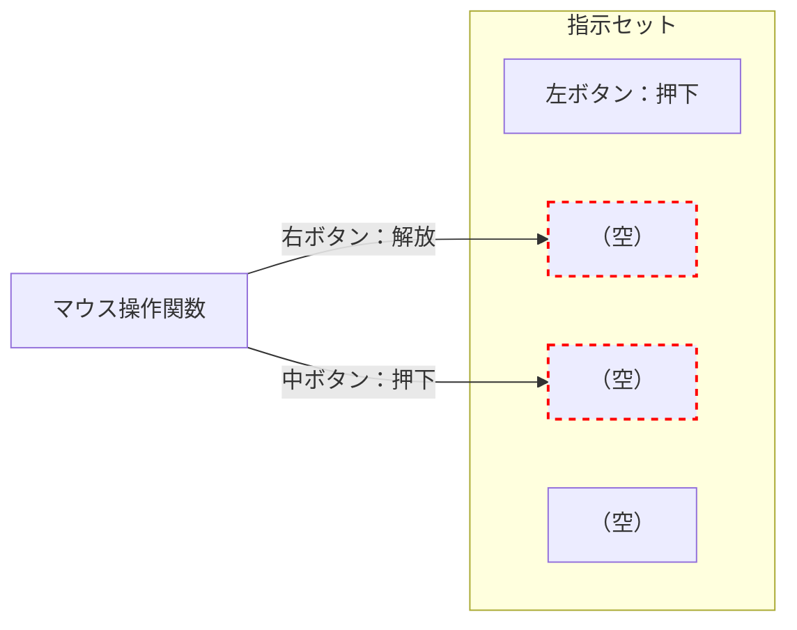

## はじめに

本項では、コントローラーからの各種入力情報（スティック、ボタン、加速度）をマウス操作の形に変換しつつ、構造体 `MouseControl` に格納していきます。

## マウス操作情報の更新

[前項](./360__struct-mouse-control)にて、マウス操作を管理する構造体 `MouseControl` を作成しました。

```cpp:マウス操作構造体
// マウスの状態を管理する構造体
struct MouseControl {
  int currentMode = MODE_CURSOR;  // 現在のモード

  // カーソルモード時のスティック関係
  int moveX = 0, moveY = 0;  // カーソル移動量（スティックの値を利用）

  // ホイールモード時のスティック関係
  int moveW = 0;  // ホイール移動量（※ スティックの Y 値を利用）
  int moveS = 0;  // ショートカットボタン（※ スティック X 値を利用）
  int shortcutThrottling = 0;  // ショートカットボタン（進む、戻る）のスロットル用

  // ボタン状態
  bool buttonStatesCurrent[NUM_BUTTONS] = {false, false};  // 現在のボタン状態（押下/解放）
  bool buttonStatesLast[NUM_BUTTONS] = {false, false};  // 直近のボタン状態（押下/解放）

  // 実行すべきマウスボタン操作指示のリスト
  static const int MAX_ACTIONS = 4; // （1 回のループ処理での）最大指示数
  MouseAction actions[MAX_ACTIONS];
  int actionCount = 0;
};

// インスタンスの生成
MouseControl mouseControl;
```

データ構造をまとめると、下表になります。

| 名前 | データ型 | 備考 |
| --- | --- | --- |
| `currentMode` | `int` | `MODE_CURSOR`, `MODE_WHEEL` の 2 択 |
| `moveX` | `int` | カーソル移動量（横） |
| `moveY` | `int` | カーソル移動量（縦） |
| `moveW` | `int` | ホイール移動量 |
| `moveS` | `int` | ショートカットボタン用 |
| `shortcutThrottling` | `int` | ショートカット操作の待機状態を管理 |
| `buttonStatesCurrent` | `bool[2]` | 物理ボタン2種（C,Z）の現在の状態 |
| `buttonStatesLast` | `bool[2]` | 物理ボタン2種（C,Z）の直近の状態 |
| `MAX_ACTIONS` | `int` | 1回の `loop` で処理する指示セット最大数（≒ 4） |
| `actions` | `MouseAction[4]` | 指示セットを配列管理 |
| `actionCount` | `int` | 指示セット操作用のインデックス |

今回行うのは、`loop` 内で取得した各種入力情報（スティック, ボタン, 加速度）を、マウス操作の形に変換することです。

下記のコードでは そのための関数 `updateMouse()` に対し、計算に必要となる コントローラー情報（`nunchukInput`）と平滑化済み加速度情報（`smoothedAccel`）を渡しています。そしてマウス操作構造体も渡し、この中に計算結果を格納するというのが、大まかな動きです。

```cpp:updateMouse関数にて、各種入力情報をマウス操作用に変換しmouseControlに格納する
void loop() {
  if(isNunchukConnected){
    // コントローラーから入力を読み取る（正常に読み取れたかで分岐）
    if(readNunchuk(nunchukInput)){
      // 加速度を平滑化処理する
      smoothAccelerometer(smoothedAccel, nunchukInput.accelX, nunchukInput.accelY, nunchukInput.accelZ);

      // マウス操作情報を更新 (マウスボタン指示に関するイベント関係も、ここで管理)
      updateMouse(nunchukInput, smoothedAccel, mouseControl);

    } else {
      // 省略：読み取り失敗時の処理
    }
  } else {
    // 省略：エラー時（未接続・通信断）の処理
  }
  delay(MOUSE_DELAY);
}
```

本項は、この `updateMouse` 関数について詳しく取り上げていきます。なお、本項で扱う設定項目は下表のとおりです。

|定数名|型|内容|
|---|---|:---|
|`STICK_CENTER_X`|`int`|スティック X 軸の中心値|
|`STICK_CENTER_Y`|`int`|スティック Y 軸の中心値|
|`STICK_DEADZONE_X`|`int`|スティック X 軸の遊び範囲|
|`STICK_DEADZONE_Y`|`int`|スティック Y 軸の遊び範囲|
|`STICK_RANGE_X`|`int`|スティック X 軸の可動範囲|
|`STICK_RANGE_Y`|`int`|スティック Y 軸の可動範囲|
|`ACCEL_CENTER_X`|`int`|加速度 X 軸の中心値|
|`ACCEL_CENTER_Y`|`int`|加速度 Y 軸の中心値|
|`ACCEL_CENTER_Z`|`int`|加速度 Z 軸の中心値|
|`MOVEMENT_CURSOR`|`int`|マウスカーソルの最大移動量|
|`MOVEMENT_WHEEL`|`int`|ホイールの最大移動量|
|`ENABLE_SCROLL_REVERSE`|`bool`|ホイールのスクロール方向を反転するか|
|`MOUSE_BUTTON_MAPS`|`int[2][2]`|*2 ボタン✕ 2 モード* でのマウスボタンのマッピング|

### 関数の定義

関数名を `updateMouse`、引数として下記の要素を受け取るようにします。

- `NunchukInput`：コントローラー入力情報（スティック、ボタン）
- `SmoothedAccelerometer`：平滑化された加速度情報
- `MouseControl`：上記 2 つによって計算したマウス操作情報を格納

```cpp
void updateMouse(const NunchukInput& nunchukInput, const SmoothedAccelerometer& smoothedAccel, MouseControl& mouseControl) {
  // 1. モード決定と切り替え
  // 2. 物理ボタンの状態更新とマウスボタン処理
  // 3. カーソル及びホイール移動量の算出
}
```

:::message

入力情報を扱う `NunchukInput`, `SmoothedAccelerometer` に関しては中で変更することはないので `const` を使っています。

:::

ここから諸々の処理を行なっていくことになりますが、まずはじめに 指示セットのキューをリセットしておきます。

これは指示セットの配列インデックスである `mouseControl.actionCount` を `0` に上書きすれば OK です。このインデックスは、指示セットの配列で空きが生じているインデックスを表すことになります。

```cpp:指示セットのキューをリセット
void updateMouse(const NunchukInput& nunchukInput, const SmoothedAccelerometer& smoothedAccel, MouseControl& mouseControl) {
  // 指示セットのキューをリセット
  mouseControl.actionCount = 0;

  // 1. モード決定と切り替え
  // 2. 物理ボタンの状態更新とマウスボタン処理
  // 3. カーソル及びホイール移動量の算出
}
```

#### `mouseControl` 内の `actionCount` と `actions[4]` との関係について補足

上記では `actionCount` を `0` にしているだけで、`actions[]` に関しては初期化をしていません。これで問題ない理由について、説明をしておきます。

本リポジトリでは、`mouseControl.actions[]` という配列を「キュー（待ち行列）」のように使っています。そして、`mouseControl.actionCount` は、そのキューに現在いくつの指示（アクション）が入っているかを示すカウンターの役割を担っています。

`updateMouse()` の最初に、上記で行なった `mouseControl.actionCount = 0;` とすることで、カウンターがリセットされ、キューは「空」であると見なされます。

新しいマウス操作指示は、この後作成する `addMouseAction()` 関数によって、指示セットを `actions[0]`, `actions[1]` ... と順番に追加することになります。そして追加する度に、`actionCount` が増えていきます。

ここで貯めた指示セット集 `actions[]` は、[本章の最後](./390__send-mouse-events)で作成する「マウス操作に反映する関数（`sendMouseEvents()`）」にて、`actionCount` の数だけループを回して、キューに入っている指示を実行することになります。

つまり、`actionCount` が `0` であれば、`actions[]` 配列に以前のデータが残っていたとしても、それが参照されることは決してありません。

なので上記の処理は、`mouseControl.actionCount = 0;` の一行だけで、キューをリセットする目的は完全に達成できているということです。

### モード決定と切り替え

現在の加速度情報からモードを算出するため、`determineOperationMode(加速度構造体)` を使います。この関数の返り値は `0`（≒ `MODE_WHEEL`）または `1`（≒ `MODE_CURSOR`）となります。

```cpp:現在のモードを算出
int newMode = determineOperationMode(smoothedAccel);
```

一方で直近のモード情報は `mouseControl.currentMode` に入っているので、両者を比較することでモードが切り替わったかを判別することができます。

モードが切り替わった場合、マウスボタンに関する処理が必要となるため、独立したイベント関数 `onSwitchMode()` を設け、実行するようにしておきます。  
（※ 内容としてはマウス操作情報の更新処理のため、引数として `mouseControl` を渡しておきます）

```cpp:モードの切り替わりを検知
void updateMouse(const NunchukInput& nunchukInput, const SmoothedAccelerometer& smoothedAccel, MouseControl& mouseControl) {
  // 指示セットのキューをリセット
  mouseControl.actionCount = 0;

  // 1. モード決定と切り替え
  //    現在の状態を算出し、変更があれば切り替え処理
  if (mouseControl.currentMode != determineOperationMode(smoothedAccel)) {
    onSwitchMode(mouseControl);
  }

  // 2. 物理ボタンの状態更新とマウスボタン処理
  // 3. カーソル及びホイール移動量の算出
}
```

#### `onSwitchMode()`

新たに定義したイベント関数 `onSwitchMode()` ですが、そこで処理するのは下記になります。

- ボタンマッピングの変更
- 現行モードの切替

ボタンマッピングに関しては、モード間でボタンの役割が異なるかを検知し、そうだった場合は下記のように処理します。

1. 旧ボタンを解放状態にするよう、マウスボタン指示を追加
2. 新ボタンを押下状態にするよう、マウスボタン指示を追加

```cpp:関数の定義
void onSwitchMode(MouseControl& mouseControl) {
  // 各物理ボタン（C, Z）について、モード切替に関する処理
  // 新旧のボタンマッピング間で差異があるかを判定し、条件を満たす場合は下記の処理を施す

  //   1. 旧ボタンを解放状態にするよう、マウスボタン指示を追加
  //   2. 新ボタンを押下状態にするよう、マウスボタン指示を追加
}
```

新旧モードは数値（`0` ≒ `MODE_WHEEL`, `1` ≒ `MODE_CURSOR`）となります。**この関数が発動している時点で新旧モードは異なる**ことが判明しているので、旧モードである `mouseControl.currentMode` がわかれば必要分が揃います。

```cpp:モードの直近及び現行の算出
int oldMode = mouseControl.currentMode;
int newMode = (oldMode == MODE_CURSOR) ? MODE_WHEEL : MODE_CURSOR;
```

そして現行ボタン 2 種（C, Z）を調べるために、ボタン数を表す定数 `NUM_BUTTONS` を使ってループ処理をかけます。下記の `i` は、物理ボタン状態を表す配列のインデックスとして使われており、１周目で C ボタンを、２周目で Z ボタンを見ることになります。

```cpp
void onSwitchMode(MouseControl& mouseControl) {
  int oldMode = mouseControl.currentMode;
  int newMode = (oldMode == MODE_CURSOR) ? MODE_WHEEL : MODE_CURSOR;

  // 各物理ボタンについて、ループ処理
  for (int i = 0; i < NUM_BUTTONS; i++) {
    // ボタンが押し続けられている状況の場合、切替処理の可能性が生じる
    if (mouseControl.buttonStatesCurrent[i] == true) {
      // 新旧モードのボタンマッピングを比較し、異なれば下記の処理を施す
      //   1. 旧ボタンを解放状態にするよう、マウスボタン指示を追加
      //   2. 新ボタンを押下状態にするよう、マウスボタン指示を追加
    }
  }
}
```

次にボタンマッピングを見ていくわけですが、これは設定項目として下記のように定義されています。  
（※ `MOUSE_LEFT` や `MOUSE_RIGHT` は実際には数値です）

```cpp:設定項目より
// モードに応じたボタンマッピング（デフォルト：{MOUSE_LEFT,MOUSE_RIGHT},{MOUSE_LEFT,MOUSE_MIDDLE}）
// 対応関係は下記となっています、`MOUSE_LEFT`, `MOUSE_RIGHT`, `MOUSE_MIDDLE` を割り当ててください
//
// { カーソルモードのCボタン , カーソルモードのZボタン },
// { ホイールモードのCボタン , ホイールモードのZボタン }
const int MOUSE_BUTTON_MAPS[2][2] = {
  { MOUSE_LEFT, MOUSE_RIGHT },
  { MOUSE_LEFT, MOUSE_MIDDLE }
};
```

この二次元配列は、それぞれ「モード」「物理ボタン（C, Z）」に対応しているため、ループ内の `i` と組み合わせると下記のようになります。

```cpp
void onSwitchMode(MouseControl& mouseControl) {
  int oldMode = mouseControl.currentMode;
  int newMode = (oldMode == MODE_CURSOR) ? MODE_WHEEL : MODE_CURSOR;

  // 各物理ボタンについて、ループ処理
  for (int i = 0; i < NUM_BUTTONS; i++) {
    // 押下し続けた状態でモードを切り替えた際、
    // 違うマウスボタンが割り振られている場合は、下記 2 つの指示を追加
    //   - 切替前のマウスボタンを "解放"
    //   - 切替後のマウスボタンを "押下"
    // （モード間で同じマウスボタンが割り振られている場合は、何もしない）
    if (mouseControl.buttonStatesCurrent[i] == true) {
      int oldMouseButton = MOUSE_BUTTON_MAPS[oldMode][i];
      int newMouseButton = MOUSE_BUTTON_MAPS[newMode][i];
      if (oldMouseButton != newMouseButton) {
         // - 旧ボタンを解放状態にするよう、マウスボタン指示を追加
         // - 新ボタンを押下状態にするよう、マウスボタン指示を追加
      }
    }
  }
}
```

残るは「指示セットの追加」と「現行モードに切り替え」です。

指示セットの追加に関しては、他の場所でも似たような処理を使うことが想定されますので、関数として独立させておきます。

関数は `addMouseAction(マウス構造体, 処理, ボタン)` としておきます。

```cpp:指示セットの追加処理とモード切替処理を追加して完成
void onSwitchMode(MouseControl& mouseControl) {
  int oldMode = mouseControl.currentMode;
  int newMode = (oldMode == MODE_CURSOR) ? MODE_WHEEL : MODE_CURSOR;

  // 各物理ボタンについて、ループ処理
  for (int i = 0; i < NUM_BUTTONS; i++) {
    // 押下し続けた状態でモードを切り替えた際、
    // 違うマウスボタンが割り振られている場合は、下記 2 つの指示を追加
    //   - 切替前のマウスボタンを "解放"
    //   - 切替後のマウスボタンを "押下"
    // （モード間で同じマウスボタンが割り振られている場合は、何もしない）
    if (mouseControl.buttonStatesCurrent[i] == true) {
      int oldMouseButton = MOUSE_BUTTON_MAPS[oldMode][i];
      int newMouseButton = MOUSE_BUTTON_MAPS[newMode][i];
      if (oldMouseButton != newMouseButton) {
        addMouseAction(mouseControl, ACTION_RELEASE, oldMouseButton);
        addMouseAction(mouseControl, ACTION_PRESS, newMouseButton);
      }
    }
  }
  // 現在のモードを更新
  mouseControl.currentMode = newMode;
}
```

これで `onSwitchMode()` に関しては完成しました。

#### `addMouseAction()`

先程設けた指示セット追加の処理を担う `addMouseAction()` を定義していきます。これが[前項](./360__struct-mouse-control)で定義した、「マウス操作関数」で**指示セット配列に内容を格納する処理**となります。



引数は下記の 3 種です。

- マウス操作の構造体（この中にある `actions[]` に指示セットを追加していく）
- 処理内容（`MouseActionType` 型）
- マウスボタン（`MOUSE_LEFT` や `MOUSE_RIGHT`、実際には数値型 `int`）

```cpp:関数の定義
void addMouseAction(MouseControl& mouseControl, MouseActionType type, int button) {
  // 指示セットを管理する配列の中に、新規に引数内容の指示セットを追加
  // （※ インデックスの若い順に、埋めていく形にすること）
}
```

空きのインデックスに関しては `mouseControl.actionCount` で管理するようにしているので、そこに追加するよう処理します。

この時、インデックスが配列の要素数を超えていないかの確認と、追加処理後にインデックスを 1 ずらす処理を加えておきます。

```cpp:インデックスが範囲内かを確認して指示セット追加、その後インデックスをずらす
void addMouseAction(MouseControl& mouseControl, MouseActionType type, int button) {
  if (mouseControl.actionCount < MouseControl::MAX_ACTIONS) {
    mouseControl.actions[mouseControl.actionCount].type = type;
    mouseControl.actions[mouseControl.actionCount].button = button;
    mouseControl.actionCount++;
  }
}
```

これで `addMouseAction()` は完成です。この関数は、後の処理でも流用します。

### 物理ボタンの状態更新とマウスボタン処理

次に物理ボタンの状態を更新し、マウスボタンに関する処理を行います。ここのマウスボタン処理は、モード切替に関わらない、通常のボタン処理となります。

#### 現行ボタン情報の取得

まずはコントローラーから取得した**現行のボタン情報**を構造体の中に格納します。あらかじめ、物理ボタンに関する定数を定義しているので、それを絡めて使います。

```cpp:物理ボタンに関する定数
const int BUTTON_C = 0;
const int BUTTON_Z = 1;
const int NUM_BUTTONS = 2;
```

```cpp:コントローラーから現行のボタン情報を取得
void updateMouse(const NunchukInput& nunchukInput, const SmoothedAccelerometer& smoothedAccel, MouseControl& mouseControl) {
  // 指示セットのキューをリセット
  mouseControl.actionCount = 0;

  // 1. モード決定と切り替え（省略）

  // 2. 物理ボタンの状態更新とマウスボタン処理
  //    現在の物理ボタン状態を更新し、直近の状態から変化があれば、マウスボタン処理を行う
  mouseControl.buttonStatesCurrent[BUTTON_C] = nunchukInput.buttonC;
  mouseControl.buttonStatesCurrent[BUTTON_Z] = nunchukInput.buttonZ;

  // 3. カーソル及びホイール移動量の算出
}
```

#### 各物理ボタンについて処理

マウスボタンについては下記のように、設定項目にてマッピング管理をしています。

```cpp:ボタンマッピングに関する設定項目
// モードに応じたボタンマッピング（デフォルト：{MOUSE_LEFT,MOUSE_RIGHT},{MOUSE_LEFT,MOUSE_MIDDLE}）
// 対応関係は下記となっています、`MOUSE_LEFT`, `MOUSE_RIGHT`, `MOUSE_MIDDLE` を割り当ててください
//
// { カーソルモードのCボタン , カーソルモードのZボタン },
// { ホイールモードのCボタン , ホイールモードのZボタン }
const int MOUSE_BUTTON_MAPS[2][2] = {
  { MOUSE_LEFT, MOUSE_RIGHT },
  { MOUSE_LEFT, MOUSE_MIDDLE }
};
```

構造としては「モード（カーソル ↔ ホイール）」と「ボタン（C ↔ Z）」の 2 種を 2 次元配列にて管理しているわけです。

ここでは物理ボタン（C, Z）の 2 つを見ていき、状態の変化があるかを判定し処理していきます。モード切替についてはここで考えないので、配列の最初の添字は `mouseControl.currentMode` で固定となります。

例として下記は、現行モード下での各物理ボタンの役割を、ボタンマッピングから取得するコードになります。

```cpp:サンプル例：現行モードでの各物理ボタンの役割を取得
const int MOUSE_BUTTON_MAPS[2][2] = {
  { MOUSE_LEFT, MOUSE_RIGHT },
  { MOUSE_LEFT, MOUSE_MIDDLE }
};

// 現行モードを `MODE_CURSOR`（≒ 0）とした場合の、各物理ボタン
int currentC = MOUSE_BUTTON_MAPS[mouseControl.currentMode][0];  // -> MOUSE_LEFT
int currentZ = MOUSE_BUTTON_MAPS[mouseControl.currentMode][1];  // -> MOUSE_RIGHT
```

上記の考えを、関数の中に取り込みます。

物理ボタンの数は `const int NUM_BUTTONS = 2;` で管理しているので、それを使ってループ処理します。

```cpp:ループ処理で各物理ボタンの添字を取得
void updateMouse(const NunchukInput& nunchukInput, const SmoothedAccelerometer& smoothedAccel, MouseControl& mouseControl) {
  // 指示セットのキューをリセット
  mouseControl.actionCount = 0;

  // 1. モード決定と切り替え（省略）

  // 2. 物理ボタンの状態更新とマウスボタン処理
  //    現在の物理ボタン状態を更新し、直近の状態から変化があれば、マウスボタン処理を行う
  mouseControl.buttonStatesCurrent[BUTTON_C] = nunchukInput.buttonC;
  mouseControl.buttonStatesCurrent[BUTTON_Z] = nunchukInput.buttonZ;
  for (int i = 0; i < NUM_BUTTONS; i++) {
    // - 処理対象となるマウスボタンを定義（現モード時の物理ボタン i に割り振られたもの）
    // - 状態が変化（解放から押下、またはその逆）している場合は、対応するマウスボタン処理を指示リストに追加
    // - 更新した物理ボタン状態を反映
  }

  // 3. カーソル及びホイール移動量の算出
}
```

`i` には `0`, `1` が入るので、`MOUSE_BUTTON_MAPS[mouseControl.currentMode][i]` の形でループで両ボタンを取り出すことができます。

```cpp:物理ボタンに対応したマウスボタンを取得
void updateMouse(const NunchukInput& nunchukInput, const SmoothedAccelerometer& smoothedAccel, MouseControl& mouseControl) {
  // 指示セットのキューをリセット
  mouseControl.actionCount = 0;

  // 1. モード決定と切り替え（省略）

  // 2. 物理ボタンの状態更新とマウスボタン処理
  //    現在の物理ボタン状態を更新し、直近の状態から変化があれば、マウスボタン処理を行う
  mouseControl.buttonStatesCurrent[BUTTON_C] = nunchukInput.buttonC;
  mouseControl.buttonStatesCurrent[BUTTON_Z] = nunchukInput.buttonZ;
  for (int i = 0; i < NUM_BUTTONS; i++) {
    // 処理対象となるマウスボタン（現モード時の物理ボタン i に割り振られたもの）
    int mouseButton = MOUSE_BUTTON_MAPS[mouseControl.currentMode][i];

    // - 状態が変化（解放から押下、またはその逆）している場合は、対応するマウスボタン処理を指示リストに追加
    // - 更新した物理ボタン状態を反映
  }

  // 3. カーソル及びホイール移動量の算出
}
```

あとは、直近のボタン状況との変化を検知します。直近の状態は `mouseControl.buttonStatesLast[i]`、現行の状態は `mouseControl.buttonStatesCurrent[i]` で取得できます。

`bool` 値の変化に従って、関数 `addMouseAction(マウス管理構造体, 指示, マウスボタン)` を使って指示セットを追加します。

指示セットを追加したら、**現行**のボタン状態を**直近**に移行させれば、処理としては完了します。

ここまでの説明をコードに起こしたのが、下記になります。

```cpp:物理ボタンの状態更新とマウスボタン処理の完成
void updateMouse(const NunchukInput& nunchukInput, const SmoothedAccelerometer& smoothedAccel, MouseControl& mouseControl) {
  // 指示セットのキューをリセット
  mouseControl.actionCount = 0;

  // 1. モード決定と切り替え（省略）

  // 2. 物理ボタンの状態更新とマウスボタン処理
  //    現在の物理ボタン状態を更新し、直近の状態から変化があれば、マウスボタン処理を行う
  mouseControl.buttonStatesCurrent[BUTTON_C] = nunchukInput.buttonC;
  mouseControl.buttonStatesCurrent[BUTTON_Z] = nunchukInput.buttonZ;
  for (int i = 0; i < NUM_BUTTONS; i++) {
    // 処理対象となるマウスボタン（現モード時の物理ボタン i に割り振られたもの）
    int mouseButton = MOUSE_BUTTON_MAPS[mouseControl.currentMode][i];

    // 状態が変化（解放から押下、またはその逆）している場合は、対応するマウスボタン処理を指示リストに追加
    if ((mouseControl.buttonStatesCurrent[i] == true) && (mouseControl.buttonStatesLast[i] == false)){
      addMouseAction(mouseControl, ACTION_PRESS, mouseButton);
    } else if ((mouseControl.buttonStatesCurrent[i] == false) && (mouseControl.buttonStatesLast[i] == true)){
      addMouseAction(mouseControl, ACTION_RELEASE, mouseButton);
    }
    // 更新した物理ボタン状態を反映
    mouseControl.buttonStatesLast[i] = mouseControl.buttonStatesCurrent[i];
  }

  // 3. カーソル及びホイール移動量の算出
}
```

これでマウスボタンに関する諸々の処理が完了となります。

### カーソル及びホイール移動量の算出

マウスボタンに関する処理は終わりましたので、ここではスティックに関する処理を行なっていきます。処理内容は下記の 2 つです。

1. スティック傾け量が遊び範囲（マージン）を超えたかを判定
2. スティック値を、設定内容に従ってカーソルやホイール移動量等に変換

#### スティック傾け量が遊び範囲を超えたかを判定

設定項目（`STICK_DEADZONE_X`, `STICK_DEADZONE_Y`）にて、スティックの遊び範囲を設定しています。これは コントローラーの個体によっては、スティックのニュートラル状態で多少のブレが生じることが考えられるためです。

まずはスティック値が、この遊び範囲（マージン）を超えて入力されているかを判定します。

二次元（X, Y）上の移動量は**三平方の定理**で計算できます。遊び範囲となる移動量は、`STICK_DEADZONE_X` と `STICK_DEADZONE_Y` を 2 乗すれば平方根の形で取得できます。Arduino で使える数学関数を使えば、下記のように表現できます。

```cpp:遊び範囲の移動量を算出
const int STICK_DEADZONE_SQ = pow(STICK_DEADZONE_X, 2) + pow(STICK_DEADZONE_Y, 2);
```

:::message

同じような計算での大きさ比較に使うだけなので、正確な数値（平方根の計算）までは必要はありません。

:::

次に、同じようにスティック傾け量を計算します。

スティック値は `nunchukInput.stickX`, `nunchukInput.stickY` にありますが、128 中心の符号なしデータです。

0 中心の符号ありデータにするためには、設定項目を使い `nunchukInput.stickX - STICK_CENTER_X`, `nunchukInput.stickY - STICK_CENTER_Y` とします。あとは同じように 2 乗し、平方根を出します。

これらを比較することで、遊び範囲を超えたかを判定することができます。

```cpp:スティック傾け量が閾値を超えたかで分岐
// 遊び範囲となる移動量（入力された移動量が下回った場合、カーソル移動しない）
const int STICK_DEADZONE_SQ = pow(STICK_DEADZONE_X, 2) + pow(STICK_DEADZONE_Y, 2);

void updateMouse(const NunchukInput& nunchukInput, const SmoothedAccelerometer& smoothedAccel, MouseControl& mouseControl) {
  // 指示セットのキューをリセット
  mouseControl.actionCount = 0;

  // 1. モード決定と切り替え（省略）
  // 2. 物理ボタンの状態更新とマウスボタン処理（省略）

  // 3. カーソル及びホイール移動量の算出
  //    スティックの傾きを移動量に変換し、設定項目の内容（遊び範囲, 最大移動量）から各種計算
  int stickDisplacementSq = pow(nunchukInput.stickX - STICK_CENTER_X, 2) + pow(nunchukInput.stickY - STICK_CENTER_Y, 2);
  if (stickDisplacementSq > STICK_DEADZONE_SQ) {

    // スティック移動量が遊び範囲を超えた場合

  } else {

    // スティック移動量が遊び範囲内の場合

  }
}
```

:::message

`STICK_DEADZONE_SQ` は、関数内でなくグローバルな場所においてあります。

これは稼働段階で固定されており、関数を実行する度に わざわざ計算する必要がないためです。

:::

#### 各種マウス操作値への変換

遊び範囲の閾値判定ができたので、次は分岐内容に従って各種マウス操作値への変換を行います。ここで設定するマウス操作値は、下表の 4 つです。

|操作値（`mouseControl`内）|内容|利用するスティック軸|関係する設定項目|
|---|---|---|---|
|`moveX`|カーソル移動量（横）|X|`MOVEMENT_CURSOR`|
|`moveY`|カーソル移動量（縦）|Y|`MOVEMENT_CURSOR`|
|`moveW`|ホイール移動量|X|`MOVEMENT_WHEEL`|
|`moveS`|ショートカットボタン用|Y|（なし）|

[先程の遊び範囲判定](#スティック傾け量が遊び範囲を超えたかを判定)では 128 中心の符号付きデータを一度 0 中心の符号ありデータにしてましたが、**ここでは 128 中心のままで考えます**。

##### スティックの物理的な移動範囲の定義

設定項目にて、スティックの中心値は `STICK_CENTER_X`, `STICK_CENTER_Y`、可動範囲は `STICK_RANGE_X`, `STICK_RANGE_Y` で管理されています。

これらを使って、スティックの物理的な移動範囲（最小、最大）を定義したものが下記になります。

```cpp:スティックの最大最小
const int STICK_MIN_X = STICK_CENTER_X - STICK_RANGE_X;  // スティック X の最小値
const int STICK_MAX_X = STICK_CENTER_X + STICK_RANGE_X;  // スティック X の最大値
const int STICK_MIN_Y = STICK_CENTER_Y - STICK_RANGE_Y;  // スティック Y の最小値
const int STICK_MAX_Y = STICK_CENTER_Y + STICK_RANGE_Y;  // スティック Y の最大値
```

##### マウス操作値の範囲定義

設定項目にて、カーソル移動量は `MOVEMENT_CURSOR`、ホイール移動量は `MOVEMENT_WHEEL` で管理されています。

**これらは 0 中心のデータ**となりますので、スティック値と違い、最小値は `-` 符号をつければ表現できます。

##### `map`関数を使った変換

スティック値は 128 中心のデータに対し、マウス操作値は 0 中心のデータになります。また両者の変化量も一致しません。スティック値 1 の変化が、マウスカーソル 1 の変化はなりません。

中心値や変化量が違う両者を 比例する形に変換したい場合、`map` 関数が使えます。

https://docs.arduino.cc/language-reference/en/functions/math/map/

これは 5 つの引数を使って、変換元の値を変換先の値に変換します。

`map(value, fromLow, fromHigh, toLow, toHigh)`

- `value`: 変換元での値
- `fromLow`: 変換**元**の最**低**値
- `fromHigh`: 変換**元**の最**高**値
- `toLow`: 変換**先**の最**低**値
- `toHigh`: 変換**先**の最**高**値

##### スティック値をマウス操作値へ変換

上記の関数 `map()` を使って変換をしていきます。

例えば、スティックX値をカーソル移動量に変換する場合は、下記のようになります。

```cpp:スティックX値をカーソル移動量に変換①
map(
  nunchukInput.stickX,                // 変換元での値
  STICK_MIN_X, STICK_MAX_X,           // 変換元での最小・最大
  -MOVEMENT_CURSOR, MOVEMENT_CURSOR   // 変換先での最小・最大
);
```

ただし、上記は完全ではありません。スティック値の範囲（`STICK_MIN_X`, `STICK_MAX_X`）は設定項目 `STICK_CENTER_X`, `STICK_RANGE_X` で構成されていますが、`nunchukInput.stickX` がこの範囲を超える可能性があるためです。

範囲を超えないよう、ここでは `constrain` 関数を使います。

https://docs.arduino.cc/language-reference/en/functions/math/constrain/

`constrain(x, a, b)`

- `x`: 制限する値
- `a`: 制限範囲の最小値
- `b`: 制限範囲の最大値

この関数を使い、カーソル移動量への変換処理を改良したものが、下記になります。

```cpp:スティックX値をカーソル移動量に変換②
map(
  constrain(nunchukInput.stickX, STICK_MIN_X, STICK_MAX_X),  // （最小最大を調整した）変換元での値
  STICK_MIN_X, STICK_MAX_X,           // 変換元での最小・最大
  -MOVEMENT_CURSOR, MOVEMENT_CURSOR   // 変換先での最小・最大
);
```

以降の処理では、この変換形式をベースに考えていきます。

##### カーソルモードの操作値変換

まずはカーソルモードの値 `moveX`, `moveY` への変換をします。なお、遊び範囲を超えない場合は全て移動なし（≒ 0）として設定します。

```cpp:カーソルモードの変換
// `updateMouse()` 用の計算済み定数（スティックに関する各種補正：遊び移動量、各軸の最小最大値）

// 遊び範囲となる移動量（入力された移動量が下回った場合、カーソル移動しない）
const int STICK_DEADZONE_SQ = pow(STICK_DEADZONE_X, 2) + pow(STICK_DEADZONE_Y, 2);

const int STICK_MIN_X = STICK_CENTER_X - STICK_RANGE_X;  // スティック X の最小値
const int STICK_MAX_X = STICK_CENTER_X + STICK_RANGE_X;  // スティック X の最大値
const int STICK_MIN_Y = STICK_CENTER_Y - STICK_RANGE_Y;  // スティック Y の最小値
const int STICK_MAX_Y = STICK_CENTER_Y + STICK_RANGE_Y;  // スティック Y の最大値


void updateMouse(const NunchukInput& nunchukInput, const SmoothedAccelerometer& smoothedAccel, MouseControl& mouseControl) {
  // 指示セットのキューをリセット
  mouseControl.actionCount = 0;

  // 1. モード決定と切り替え（省略）
  // 2. 物理ボタンの状態更新とマウスボタン処理（省略）

  // 3. カーソル及びホイール移動量の算出
  //    スティックの傾きを移動量に変換し、設定項目の内容（遊び範囲, 最大移動量）から各種計算
  int stickDisplacementSq = pow(nunchukInput.stickX - STICK_CENTER_X, 2) + pow(nunchukInput.stickY - STICK_CENTER_Y, 2);
  if (stickDisplacementSq > STICK_DEADZONE_SQ) {
    // --- カーソルモード関係 ---

    // スティック情報は中心値 128 のため、0 中心に変換 ＋ 最大移動量に合わせた形で整形
    mouseControl.moveX = map(
      constrain(nunchukInput.stickX, STICK_MIN_X, STICK_MAX_X),
      STICK_MIN_X, STICK_MAX_X,
      -MOVEMENT_CURSOR, MOVEMENT_CURSOR
    );
    mouseControl.moveY = map(
      constrain(nunchukInput.stickY, STICK_MIN_Y, STICK_MAX_Y),
      STICK_MIN_Y, STICK_MAX_Y,
      -MOVEMENT_CURSOR, MOVEMENT_CURSOR
    ) * (-1); // `Mouse.move()` 用に反転処理

    // --- ホイールモード関係 ---

    // - 入力に対するホイール方向
    // - ホイール移動量は、スティック Y 値を利用
    // - ショートカットボタンの判定はスティック X 値を利用（ホイールモード時）

  } else {
    // スティック移動量が遊び範囲内のため、移動量 0
    mouseControl.moveX = 0;
    mouseControl.moveY = 0;
    mouseControl.moveW = 0;
    mouseControl.moveS = 0;
  }
}
```

:::message

`moveY` に関しては、`-1` を掛けて符号反転をしています。これにより 上に傾けるとマイナス方向に、下に傾けるとプラス方向に数値が移動します。

これは、[この後](./390__send-mouse-events)にて使う `Mouse.move()` 関数（マウスカーソルを移動する処理）での調整のためです。

:::

##### ホイールモードの操作値変換

次にホイールモード関係の変換を行います。カーソルモードと違い、下記の特徴があります。

- ホイール移動は反転可能（上方向の傾けで下スクロール）
  - 設定項目 `ENABLE_SCROLL_REVERSE`（`bool`）で管理している
  - これを使って符号を操作、反転時は移動量にマイナスをかけることで実装
- ショートカットボタンに関しては、特段の設定項目はなし
  - オンオフの管理をしたいだけなので、`± 1` の範囲で変換

これらを反映したものが、下記になります。これでカーソル及びホイール移動量の算出は完成しました。

```cpp
// `updateMouse()` 用の計算済み定数（スティックに関する各種補正：遊び移動量、各軸の最小最大値）

// 遊び範囲となる移動量（入力された移動量が下回った場合、カーソル移動しない）
const int STICK_DEADZONE_SQ = pow(STICK_DEADZONE_X, 2) + pow(STICK_DEADZONE_Y, 2);

const int STICK_MIN_X = STICK_CENTER_X - STICK_RANGE_X;  // スティック X の最小値
const int STICK_MAX_X = STICK_CENTER_X + STICK_RANGE_X;  // スティック X の最大値
const int STICK_MIN_Y = STICK_CENTER_Y - STICK_RANGE_Y;  // スティック Y の最小値
const int STICK_MAX_Y = STICK_CENTER_Y + STICK_RANGE_Y;  // スティック Y の最大値


void updateMouse(const NunchukInput& nunchukInput, const SmoothedAccelerometer& smoothedAccel, MouseControl& mouseControl) {
  // 指示セットのキューをリセット
  mouseControl.actionCount = 0;

  // 1. モード決定と切り替え（省略）
  // 2. 物理ボタンの状態更新とマウスボタン処理（省略）

  // 3. カーソル及びホイール移動量の算出
  //    スティックの傾きを移動量に変換し、設定項目の内容（遊び範囲, 最大移動量）から各種計算
  int stickDisplacementSq = pow(nunchukInput.stickX - STICK_CENTER_X, 2) + pow(nunchukInput.stickY - STICK_CENTER_Y, 2);
  if (stickDisplacementSq > STICK_DEADZONE_SQ) {
    // --- カーソルモード関係 ---

    // スティック情報は中心値 128 のため、0 中心に変換 ＋ 最大移動量に合わせた形で整形
    mouseControl.moveX = map(
      constrain(nunchukInput.stickX, STICK_MIN_X, STICK_MAX_X),
      STICK_MIN_X, STICK_MAX_X,
      -MOVEMENT_CURSOR, MOVEMENT_CURSOR
    );
    mouseControl.moveY = map(
      constrain(nunchukInput.stickY, STICK_MIN_Y, STICK_MAX_Y),
      STICK_MIN_Y, STICK_MAX_Y,
      -MOVEMENT_CURSOR, MOVEMENT_CURSOR
    ) * (-1); // `Mouse.move()` 用に反転処理

    // --- ホイールモード関係 ---

    // 入力に対するホイール方向
    int direction = ENABLE_SCROLL_REVERSE ? -1 : 1;

    // ホイール移動量は、スティック Y 値を利用
    mouseControl.moveW = map(
      constrain(nunchukInput.stickY, STICK_MIN_Y, STICK_MAX_Y),
      STICK_MIN_Y, STICK_MAX_Y,
      -MOVEMENT_WHEEL, MOVEMENT_WHEEL
    ) * direction;  // 反転モード時はマイナスを掛ける

    // ショートカットボタンの判定はスティック X 値を利用（ホイールモード時）
    mouseControl.moveS = map(
      constrain(nunchukInput.stickX, STICK_MIN_X, STICK_MAX_X),
      STICK_MIN_X, STICK_MAX_X,
      -1, 1    // 調整の必要はないので、±1 で固定
    );
  } else {
    // スティック移動量が遊び範囲内のため、移動量 0
    mouseControl.moveX = 0;
    mouseControl.moveY = 0;
    mouseControl.moveW = 0;
    mouseControl.moveS = 0;
  }
}
```

## まとめ

本項では、コントローラーからの各種入力情報（スティック、ボタン、加速度）をマウス操作の形に変換しつつ、構造体 `MouseControl` に格納していく処理を行いました。

この段階では「何をするか」という情報を格納しただけで、マウス操作には反映されていない状態です。ここからデバッグ用に内容を出力したり、実際のマウス操作に反映したりと分岐させることができます。

次項では、そのうちの 1 つであるデバッグ出力を実装していきます。

:::details ここまでのコード

```cpp
// ◤◢◤◢◤◢◤◢◤◢◤◢◤◢◤◢◤◢◤◢◤◢◤◢◤◢◤◢◤◢◤◢◤◢◤◢◤◢◤◢◤◢◤◢◤◢◤◢◤◢◤◢
// ライブラリ (Libraries)
// ◤◢◤◢◤◢◤◢◤◢◤◢◤◢◤◢◤◢◤◢◤◢◤◢◤◢◤◢◤◢◤◢◤◢◤◢◤◢◤◢◤◢◤◢◤◢◤◢◤◢◤◢

#include <Wire.h>
#include <Mouse.h>
#include <Keyboard.h>
#include <math.h>
#include <stdio.h>


// ◤◢◤◢◤◢◤◢◤◢◤◢◤◢◤◢◤◢◤◢◤◢◤◢◤◢◤◢◤◢◤◢◤◢◤◢◤◢◤◢◤◢◤◢◤◢◤◢◤◢◤◢
// 内部定義 (Internal definitions)
// ※ 通常、このセクションを変更する必要はありません
// ◤◢◤◢◤◢◤◢◤◢◤◢◤◢◤◢◤◢◤◢◤◢◤◢◤◢◤◢◤◢◤◢◤◢◤◢◤◢◤◢◤◢◤◢◤◢◤◢◤◢◤◢

// 向き判定に使う 6 方向：XYZ軸(3) ✕ 正負(2)
enum TargetAxis {
  AXIS_X_NEG, AXIS_X_POS,  // X 軸方向（-/+）: 左傾斜 / 右傾斜
  AXIS_Y_NEG, AXIS_Y_POS,  // Y 軸方向（-/+）: 後傾 / 前傾
  AXIS_Z_NEG, AXIS_Z_POS  // Z 軸方向（-/+）: 表向き / 裏向き
};

// マウス操作での処理情報（`ACTION_NONE`, `ACTION_PRESS`, `ACTION_RELEASE`）
enum MouseActionType { ACTION_NONE, ACTION_PRESS, ACTION_RELEASE };

#define MODE_CURSOR 0
#define MODE_WHEEL 1

const int BUTTON_C = 0;
const int BUTTON_Z = 1;
const int NUM_BUTTONS = 2;


// ◤◢◤◢◤◢◤◢◤◢◤◢◤◢◤◢◤◢◤◢◤◢◤◢◤◢◤◢◤◢◤◢◤◢◤◢◤◢◤◢◤◢◤◢◤◢◤◢◤◢◤◢
// 設定項目 (User-configurable settings)
// ※ このセクション内の値は、好みに応じて調整してください
// ◤◢◤◢◤◢◤◢◤◢◤◢◤◢◤◢◤◢◤◢◤◢◤◢◤◢◤◢◤◢◤◢◤◢◤◢◤◢◤◢◤◢◤◢◤◢◤◢◤◢◤◢

// === デバッグ & LED =============================================================

// デバッグモードを有効化する（デフォルト：false）
// ※ デバッグ時は、IDE シリアルモニター上に状態を出力します
const bool ENABLE_DEBUG_MODE = false;

// 状態を可視化するため LED を使用する（デフォルト：true）
// ※ 点灯はホイールモード、点滅は接続エラーを示します
const bool ENABLE_LED = true;

// 使用する LED ピン番号（デフォルト：13）
// ※ ENABLE_LED 有効時に使用します。デフォルトの 13 は、Arduino のオンボード LED です。
const int LEDPIN = 13;

// === デバイス関係 ===============================================================

// ヌンチャク種別、クロの場合は false に変更（デフォルト：true）
const bool IS_NUNCHUK_SHIRO = true;

// Macintosh の場合は true に変更（デフォルト：false）
const bool IS_MACINTOSH = false;

// === ヌンチャク物理特性のデフォルト値 ===========================================

// スティック X 軸の中心値（デフォルト：128）
const int STICK_CENTER_X = 128;

// スティック Y 軸の中心値（デフォルト：128）
const int STICK_CENTER_Y = 128;

// スティック X 軸の遊び範囲（デフォルト：10）
const int STICK_DEADZONE_X = 10;

// スティック Y 軸の遊び範囲（デフォルト：10）
const int STICK_DEADZONE_Y = 10;

// スティック X 軸の可動範囲（デフォルト：90）
const int STICK_RANGE_X = 90;

// スティック Y 軸の可動範囲（デフォルト：90）
const int STICK_RANGE_Y = 90;

// 加速度 X 軸の中心値（デフォルト：512）
const int ACCEL_CENTER_X = 512;

// 加速度 Y 軸の中心値（デフォルト：512）
const int ACCEL_CENTER_Y = 512;

// 加速度 Z 軸の中心値（デフォルト：512）
const int ACCEL_CENTER_Z = 512;

// 誤差が大きい加速度を平滑化するためのサンプリング数（デフォルト：50）
// ※ 10 〜 100 の間での運用を推奨します。範囲外はメモリ不足等が発生する恐れがあります。
const int ACCEL_SMOOTHING_SAMPLES = 50;

// === マウスの挙動 ===============================================================

// マウス操作のディレイ（デフォルト：10 [ミリ秒単位]）
// 増減することで、全体の速さを調整することができます。
const int MOUSE_DELAY = 10;

// マウスカーソルの最大移動量（デフォルト：5, 最小：3）
const int MOVEMENT_CURSOR = 5;

// ホイールの最大移動量（デフォルト：1）
const int MOVEMENT_WHEEL = 1;

// ホイールによるスクロール方向を反転する（デフォルト：false）
const bool ENABLE_SCROLL_REVERSE = false;

// ホイールモードのスティック左右に「戻る」「進む」機能を割り当てる（デフォルト：true）
const bool ENABLE_SHORTCUT_FUNCTIONS = true;

// ショートカットボタン（進む、戻る）の待機回数（`ENABLE_SHORTCUT_FUNCTIONS` 有効時）
// ※ 待機時間は MOUSE_DELAY を掛けた値（ミリ秒）となる。
const int SHORTCUT_WAIT_TIME = 100;

// === モード切替ロジック ============================================================

// モード切替で判定する向き（デフォルト：AXIS_Y_NEG）
// - AXIS_X_NEG : X 軸方向マイナス、左傾斜
// - AXIS_X_POS : X 軸方向プラス、右傾斜
// - AXIS_Y_NEG : Y 軸方向マイナス、後傾
// - AXIS_Y_POS : Y 軸方向プラス、前傾
// - AXIS_Z_NEG : Z 軸方向マイナス、裏向き
// - AXIS_Z_POS : Z 軸方向プラス、表向き
const TargetAxis TARGET_AXIS = AXIS_Y_NEG;

// 向き判定で許容する角度（デフォルト：30.0）
// ※ 大きいほど判定が緩くなるので注意
const float MODE_SWITCH_ANGLE_MARGIN = 30.0;

// === ボタンマッピング ===============================================================

// モードに応じたボタンマッピング（デフォルト：{MOUSE_LEFT,MOUSE_RIGHT},{MOUSE_LEFT,MOUSE_MIDDLE}）
// 対応関係は下記となっています、`MOUSE_LEFT`, `MOUSE_RIGHT`, `MOUSE_MIDDLE` を割り当ててください
//
// { カーソルモードのCボタン , カーソルモードのZボタン },
// { ホイールモードのCボタン , ホイールモードのZボタン }
const int MOUSE_BUTTON_MAPS[2][2] = {
  { MOUSE_LEFT, MOUSE_RIGHT },
  { MOUSE_LEFT, MOUSE_MIDDLE }
};


// ◤◢◤◢◤◢◤◢◤◢◤◢◤◢◤◢◤◢◤◢◤◢◤◢◤◢◤◢◤◢◤◢◤◢◤◢◤◢◤◢◤◢◤◢◤◢◤◢◤◢◤◢
// 構造体定義 (Data structures)
// ◤◢◤◢◤◢◤◢◤◢◤◢◤◢◤◢◤◢◤◢◤◢◤◢◤◢◤◢◤◢◤◢◤◢◤◢◤◢◤◢◤◢◤◢◤◢◤◢◤◢◤◢

// コントローラーから取得した生データ
struct NunchukInput {
  uint8_t stickX, stickY;  // スティック軸（符号なし8bit）
  bool buttonC, buttonZ;  // ボタン（true: 押下状態, false: 解放状態）
  uint16_t accelX, accelY, accelZ;  // 加速度（符号なし10bit）
  NunchukInput() :
    stickX(STICK_CENTER_X), stickY(STICK_CENTER_Y),
    buttonC(false), buttonZ(false),
    accelX(ACCEL_CENTER_X), accelY(ACCEL_CENTER_Y), accelZ(ACCEL_CENTER_Z)
    {}
};


// 平滑化された加速度情報
struct SmoothedAccelerometer {
  int accelX, accelY, accelZ;
  uint32_t accelSumX, accelSumY, accelSumZ;
  int accelBufX[ACCEL_SMOOTHING_SAMPLES];
  int accelBufY[ACCEL_SMOOTHING_SAMPLES];
  int accelBufZ[ACCEL_SMOOTHING_SAMPLES];
  int accelBufIndex;
  SmoothedAccelerometer() :
    accelX(ACCEL_CENTER_X), accelY(ACCEL_CENTER_Y), accelZ(ACCEL_CENTER_Z),
    accelSumX((uint32_t)ACCEL_CENTER_X * ACCEL_SMOOTHING_SAMPLES),  // `int * int = int` 回避のキャスト
    accelSumY((uint32_t)ACCEL_CENTER_Y * ACCEL_SMOOTHING_SAMPLES),
    accelSumZ((uint32_t)ACCEL_CENTER_Z * ACCEL_SMOOTHING_SAMPLES),
    accelBufIndex(0)
    {
      for(int i = 0; i < ACCEL_SMOOTHING_SAMPLES; ++i) {
        accelBufX[i] = ACCEL_CENTER_X;
        accelBufY[i] = ACCEL_CENTER_Y;
        accelBufZ[i] = ACCEL_CENTER_Z;
      }
    }
};


// マウスボタン操作の指示セット
// ※ マウスボタンと処理（押下/解放）で 1 セット
struct MouseAction {
  int button = 0; // MOUSE_LEFT, MOUSE_RIGHT など
  MouseActionType type = ACTION_NONE;
};

// マウスの状態を管理する構造体
struct MouseControl {
  int currentMode = MODE_CURSOR;  // 現在のモード

  // カーソルモード時のスティック関係
  int moveX = 0, moveY = 0;  // カーソル移動量（スティックの値を利用）

  // ホイールモード時のスティック関係
  int moveW = 0;  // ホイール移動量（※ スティックの Y 値を利用）
  int moveS = 0;  // ショートカットボタン用（※ スティック X 値を利用）
  int shortcutThrottling = 0;  // ショートカットボタン（進む、戻る）のスロットル用

  // ボタン状態
  bool buttonStatesCurrent[NUM_BUTTONS] = {false, false};  // 現在のボタン状態（押下/解放）
  bool buttonStatesLast[NUM_BUTTONS] = {false, false};  // 直近のボタン状態（押下/解放）

  // マウスボタン操作指示セットのキュー
  static const int MAX_ACTIONS = 4; // （1 回のループ処理での）最大指示数
  MouseAction actions[MAX_ACTIONS];
  int actionCount = 0;
};


// ◤◢◤◢◤◢◤◢◤◢◤◢◤◢◤◢◤◢◤◢◤◢◤◢◤◢◤◢◤◢◤◢◤◢◤◢◤◢◤◢◤◢◤◢◤◢◤◢◤◢◤◢
// グローバル変数・インスタンス (Global variables & instances)
// ◤◢◤◢◤◢◤◢◤◢◤◢◤◢◤◢◤◢◤◢◤◢◤◢◤◢◤◢◤◢◤◢◤◢◤◢◤◢◤◢◤◢◤◢◤◢◤◢◤◢◤◢

// 各種構造体のインスタンス
NunchukInput nunchukInput;
SmoothedAccelerometer smoothedAccel;
MouseControl mouseControl;

// ヌンチャクのアドレス
const int NUNCHUK_ADDRESS = 0x52;

// ヌンチャクの通信判定
bool isNunchukConnected = false;


// ◤◢◤◢◤◢◤◢◤◢◤◢◤◢◤◢◤◢◤◢◤◢◤◢◤◢◤◢◤◢◤◢◤◢◤◢◤◢◤◢◤◢◤◢◤◢◤◢◤◢◤◢
// 関数プロトタイプ宣言 (Function prototypes)
// ◤◢◤◢◤◢◤◢◤◢◤◢◤◢◤◢◤◢◤◢◤◢◤◢◤◢◤◢◤◢◤◢◤◢◤◢◤◢◤◢◤◢◤◢◤◢◤◢◤◢◤◢

bool initializeNunchuk();
bool readNunchuk(NunchukInput& nunchukInput);
void smoothAccelerometer(SmoothedAccelerometer& smoothedAccel, int newAccelX, int newAccelY, int newAccelZ);
void updateMouse(const NunchukInput& nunchukInput, const SmoothedAccelerometer& smoothedAccel, MouseControl& mouseControl);
int determineOperationMode(const SmoothedAccelerometer& smoothedAccel);
void addMouseAction(MouseControl& mouseControl, MouseActionType type, int button);
void onSwitchMode(MouseControl& mouseControl, int newMode);


// ◤◢◤◢◤◢◤◢◤◢◤◢◤◢◤◢◤◢◤◢◤◢◤◢◤◢◤◢◤◢◤◢◤◢◤◢◤◢◤◢◤◢◤◢◤◢◤◢◤◢◤◢
// メイン処理 (Main: setup, loop)
// ◤◢◤◢◤◢◤◢◤◢◤◢◤◢◤◢◤◢◤◢◤◢◤◢◤◢◤◢◤◢◤◢◤◢◤◢◤◢◤◢◤◢◤◢◤◢◤◢◤◢◤◢

// 起動時に１度だけ処理される関数
void setup() {
  if (ENABLE_DEBUG_MODE) Serial.begin(9600);
  Wire.begin();
  Mouse.begin();
  Keyboard.begin();
  if(ENABLE_LED) pinMode(LEDPIN, OUTPUT);

  isNunchukConnected = initializeNunchuk();
}

// セットアップ後、常時処理される関数
void loop() {
  if(isNunchukConnected){
    // コントローラーから入力を読み取る（正常に読み取れたかで分岐）
    if(readNunchuk(nunchukInput)){
      // 加速度を平滑化処理する
      smoothAccelerometer(smoothedAccel, nunchukInput.accelX, nunchukInput.accelY, nunchukInput.accelZ);

      // マウス操作情報を更新 (マウスボタン指示に関するイベント関係も、ここで管理)
      updateMouse(nunchukInput, smoothedAccel, mouseControl);

    } else {
      // 読み取り失敗したので、一度マウスボタン関係を全停止させる
      isNunchukConnected = false;
      Mouse.release(MOUSE_LEFT);
      Mouse.release(MOUSE_RIGHT);
      Mouse.release(MOUSE_MIDDLE);
    }
  } else {
    // エラー時（未接続・通信断）の処理

    // LEDの高速点滅で、ユーザーにエラーを通知
    if(ENABLE_LED) digitalWrite(LEDPIN, !digitalRead(LEDPIN));
    delay(100);

    // 再度初期化を施し、接続できないかを試す
    isNunchukConnected = initializeNunchuk();
    if (ENABLE_LED && isNunchukConnected) digitalWrite(LEDPIN, LOW);
  }
  delay(MOUSE_DELAY);
}


// ◤◢◤◢◤◢◤◢◤◢◤◢◤◢◤◢◤◢◤◢◤◢◤◢◤◢◤◢◤◢◤◢◤◢◤◢◤◢◤◢◤◢◤◢◤◢◤◢◤◢◤◢
// 機能ごとの関数 (Functions)
// ◤◢◤◢◤◢◤◢◤◢◤◢◤◢◤◢◤◢◤◢◤◢◤◢◤◢◤◢◤◢◤◢◤◢◤◢◤◢◤◢◤◢◤◢◤◢◤◢◤◢◤◢

// === Nunchuk 通信関連 =========================================================

// コントローラーとの通信確立（ハンドシェイク）
bool initializeNunchuk() {
  // 返り値、`endTransmission()` が 1 度でも失敗すると `false`
  bool result = true;

  // 種類別に通信
  if(IS_NUNCHUK_SHIRO){
    // ヌンチャク・シロの初期化
    Wire.beginTransmission(NUNCHUK_ADDRESS);
    Wire.write(0x40);
    Wire.write(0x00);
    if (Wire.endTransmission() != 0) result = false;
  } else {
    // ヌンチャク・クロの初期化
    Wire.beginTransmission(NUNCHUK_ADDRESS);
    Wire.write(0xF0);
    Wire.write(0x55);
    if (Wire.endTransmission() != 0) result = false;
    delay(10);

    Wire.beginTransmission(NUNCHUK_ADDRESS);
    Wire.write(0xFB);
    Wire.write(0x00);
    if (Wire.endTransmission() != 0) result = false;
  }
  delay(10);
  return result;
}


/**
 * コントローラーからデータを読み取る
 *
 * @param nunchukInput `NunchukInput` 構造体への参照
 * @return 読み取り成功時は `true`、失敗時は `false`
 * @note 読み取ったデータは、`NunchukInput` 構造体に格納される
 */
bool readNunchuk(NunchukInput& nunchukInput) {
  uint8_t rawData[6];  // コントローラーから取得された生データ
  int byteIndex = 0;

  // I2C通信でデータを取得（配列格納時に、信号をデコードしている）
  Wire.requestFrom(NUNCHUK_ADDRESS, 6);
  while (Wire.available() && byteIndex < 6) {
    rawData[byteIndex] = (Wire.read() ^ 0x17) + 0x17;
    byteIndex++;
  }
  Wire.beginTransmission(NUNCHUK_ADDRESS);
  Wire.write(0x00);
  Wire.endTransmission();

  // 取得したデータを構造体に格納
  if (byteIndex >= 5) {
    nunchukInput.stickX = rawData[0];
    nunchukInput.stickY = rawData[1];

    // 末尾のバイトデータに複数データが詰め込まれている（物理ボタンの状態、各軸の加速度情報下位ビット）
    uint8_t packedData = rawData[5];
    nunchukInput.buttonZ = !bitRead(packedData, 0);  // true が押下になるように反転している
    nunchukInput.buttonC = !bitRead(packedData, 1);
    nunchukInput.accelX = ((uint16_t)rawData[2] << 2) | ((packedData & B00001100) >> 2);
    nunchukInput.accelY = ((uint16_t)rawData[3] << 2) | ((packedData & B00110000) >> 4);
    nunchukInput.accelZ = ((uint16_t)rawData[4] << 2) | ((packedData & B11000000) >> 6);

    return true;
  }
  return false;
}

// === データ処理 ==================================================================

/**
 *  加速度データを平滑化するための関数
 *
 *  @param smoothedAccel SmoothedAccelerometer 構造体への参照
 *  @param newAccelX 新しい加速度 X 値
 *  @param newAccelY 新しい加速度 Y 値
 *  @param newAccelZ 新しい加速度 Z 値
 *  @note この関数は、加速度データを平滑化するために、過去のデータを使用して新しい値を計算します。
 *        平滑化のために、過去のサンプル数（`ACCEL_SMOOTHING_SAMPLES`）を使用します。
 */
void smoothAccelerometer(SmoothedAccelerometer& smoothedAccel, int newAccelX, int newAccelY, int newAccelZ) {
  // 平滑値を算出（最も古いデータを新規データに入れ替えて計算）
  smoothedAccel.accelSumX -= smoothedAccel.accelBufX[smoothedAccel.accelBufIndex];
  smoothedAccel.accelSumY -= smoothedAccel.accelBufY[smoothedAccel.accelBufIndex];
  smoothedAccel.accelSumZ -= smoothedAccel.accelBufZ[smoothedAccel.accelBufIndex];
  smoothedAccel.accelSumX += newAccelX;
  smoothedAccel.accelSumY += newAccelY;
  smoothedAccel.accelSumZ += newAccelZ;
  smoothedAccel.accelX = smoothedAccel.accelSumX / ACCEL_SMOOTHING_SAMPLES;
  smoothedAccel.accelY = smoothedAccel.accelSumY / ACCEL_SMOOTHING_SAMPLES;
  smoothedAccel.accelZ = smoothedAccel.accelSumZ / ACCEL_SMOOTHING_SAMPLES;

  // データ更新（最も古いデータを新規のデータに差し替え）
  smoothedAccel.accelBufX[smoothedAccel.accelBufIndex] = newAccelX;
  smoothedAccel.accelBufY[smoothedAccel.accelBufIndex] = newAccelY;
  smoothedAccel.accelBufZ[smoothedAccel.accelBufIndex] = newAccelZ;

  // インデックスの更新（サンプル数を超えると 0 に戻る）
  smoothedAccel.accelBufIndex = (smoothedAccel.accelBufIndex + 1) % ACCEL_SMOOTHING_SAMPLES;
}


// `updateMouse()` 用の計算済み定数（スティックに関する各種補正：遊び移動量、各軸の最小最大値）

// 遊び範囲となる移動量（入力された移動量が下回った場合、カーソル移動しない）
const int STICK_DEADZONE_SQ = pow(STICK_DEADZONE_X, 2) + pow(STICK_DEADZONE_Y, 2);

const int STICK_MIN_X = STICK_CENTER_X - STICK_RANGE_X;  // スティック X の最小値
const int STICK_MAX_X = STICK_CENTER_X + STICK_RANGE_X;  // スティック X の最大値
const int STICK_MIN_Y = STICK_CENTER_Y - STICK_RANGE_Y;  // スティック Y の最小値
const int STICK_MAX_Y = STICK_CENTER_Y + STICK_RANGE_Y;  // スティック Y の最大値

/**
 * マウスの状態を更新する関数
 *
 * 1. モードの決定と切り替え
 * 2. 物理ボタンの状態更新とマウスボタン処理
 * 3. カーソル及びホイール移動量の算出
 *
 * @param nunchukInput コントローラーの状態（`NunchukInput` 構造体）
 * @param smoothedAccel 平滑化された加速度情報（`SmoothedAccelerometer` 構造体）
 * @param mouseControl マウスの状態（`MouseControl` 構造体）
 */
void updateMouse(const NunchukInput& nunchukInput, const SmoothedAccelerometer& smoothedAccel, MouseControl& mouseControl) {
  // 指示セットのキューをリセット
  mouseControl.actionCount = 0;

  // 1. モード決定と切り替え
  //    現在の状態を算出し、変更があれば切り替え処理
  if (mouseControl.currentMode != determineOperationMode(smoothedAccel)) {
    onSwitchMode(mouseControl);
  }

  // 2. 物理ボタンの状態更新とマウスボタン処理
  //    現在の物理ボタン状態を更新し、直近の状態から変化があれば、マウスボタン処理を行う
  mouseControl.buttonStatesCurrent[BUTTON_C] = nunchukInput.buttonC;
  mouseControl.buttonStatesCurrent[BUTTON_Z] = nunchukInput.buttonZ;
  for (int i = 0; i < NUM_BUTTONS; i++) {
    // 処理対象となるマウスボタン（現モード時の物理ボタン i に割り振られたもの）
    int mouseButton = MOUSE_BUTTON_MAPS[mouseControl.currentMode][i];

    // 状態が変化（解放から押下、またはその逆）している場合は、対応するマウスボタン処理を指示リストに追加
    if ((mouseControl.buttonStatesCurrent[i] == true) && (mouseControl.buttonStatesLast[i] == false)){
      addMouseAction(mouseControl, ACTION_PRESS, mouseButton);
    } else if ((mouseControl.buttonStatesCurrent[i] == false) && (mouseControl.buttonStatesLast[i] == true)){
      addMouseAction(mouseControl, ACTION_RELEASE, mouseButton);
    }
    // 更新した物理ボタン状態を反映
    mouseControl.buttonStatesLast[i] = mouseControl.buttonStatesCurrent[i];
  }

  // 3. カーソル及びホイール移動量の算出
  //    スティックの傾きを移動量に変換し、設定項目の内容（遊び範囲, 最大移動量）から各種計算
  int stickDisplacementSq = pow(nunchukInput.stickX - STICK_CENTER_X, 2) + pow(nunchukInput.stickY - STICK_CENTER_Y, 2);
  if (stickDisplacementSq > STICK_DEADZONE_SQ) {
    // --- カーソルモード関係 ---

    // スティック情報は中心値 128 のため、0 中心に変換 ＋ 最大移動量に合わせた形で整形
    mouseControl.moveX = map(
      constrain(nunchukInput.stickX, STICK_MIN_X, STICK_MAX_X),
      STICK_MIN_X, STICK_MAX_X,
      -MOVEMENT_CURSOR, MOVEMENT_CURSOR
    );
    mouseControl.moveY = map(
      constrain(nunchukInput.stickY, STICK_MIN_Y, STICK_MAX_Y),
      STICK_MIN_Y, STICK_MAX_Y,
      -MOVEMENT_CURSOR, MOVEMENT_CURSOR
    ) * (-1); // `Mouse.move()` 用に反転処理

    // --- ホイールモード関係 ---

    // 入力に対するホイール方向
    int direction = ENABLE_SCROLL_REVERSE ? -1 : 1;

    // ホイール移動量は、スティック Y 値を利用
    mouseControl.moveW = map(
      constrain(nunchukInput.stickY, STICK_MIN_Y, STICK_MAX_Y),
      STICK_MIN_Y, STICK_MAX_Y,
      -MOVEMENT_WHEEL, MOVEMENT_WHEEL
    ) * direction;  // 反転モード時はマイナスを掛ける

    // ショートカットボタンの判定はスティック X 値を利用（ホイールモード時）
    mouseControl.moveS = map(
      constrain(nunchukInput.stickX, STICK_MIN_X, STICK_MAX_X),
      STICK_MIN_X, STICK_MAX_X,
      -1, 1    // 調整の必要はないので、±1 で固定
    );
  } else {
    // スティック移動量が遊び範囲内のため、移動量 0
    mouseControl.moveX = 0;
    mouseControl.moveY = 0;
    mouseControl.moveW = 0;
    mouseControl.moveS = 0;
  }
}


// === マウスイベント処理 ============================================================

/**
 * マウスの指示リストに、指示を追加する
 *
 *  @param mouseControl `MouseControl` 構造体への参照
 *  @param type マウス操作の指示情報（`ACTION_NONE`, `ACTION_PRESS`, `ACTION_RELEASE`）
 *  @param button 対応するマウスボタン（`MOUSE_LEFT`, `MOUSE_RIGHT`, `MOUSE_MIDDLE`）
 *  @note ここで設定した `mouseControl.actions[]` の内容が、最終的に `sendMouseEvents()` で反映される
 */
void addMouseAction(MouseControl& mouseControl, MouseActionType type, int button) {
  if (mouseControl.actionCount < MouseControl::MAX_ACTIONS) {
    mouseControl.actions[mouseControl.actionCount].type = type;
    mouseControl.actions[mouseControl.actionCount].button = button;
    mouseControl.actionCount++;
  }
}


/**
 * モード切替の処理を行う
 *
 * 1. モード切替時に 違うマウスボタンが割り当てられている場合は、適切に処理（押下と解放）
 * 2. `currentMode` の更新
 *
 * @param mouseControl `MouseControl` 構造体への参照
 */
void onSwitchMode(MouseControl& mouseControl) {
  int oldMode = mouseControl.currentMode;
  int newMode = (oldMode == MODE_CURSOR) ? MODE_WHEEL : MODE_CURSOR;

  // 各物理ボタンについて、ループ処理
  for (int i = 0; i < NUM_BUTTONS; i++) {
    // 押下し続けた状態でモードを切り替えた際、
    // 違うマウスボタンが割り振られている場合は、下記 2 つの指示を追加
    //   - 切替前のマウスボタンを "解放"
    //   - 切替後のマウスボタンを "押下"
    // （モード間で同じマウスボタンが割り振られている場合は、何もしない）
    if (mouseControl.buttonStatesCurrent[i] == true) {
      int oldMouseButton = MOUSE_BUTTON_MAPS[oldMode][i];
      int newMouseButton = MOUSE_BUTTON_MAPS[newMode][i];
      if (oldMouseButton != newMouseButton) {
        addMouseAction(mouseControl, ACTION_RELEASE, oldMouseButton);
        addMouseAction(mouseControl, ACTION_PRESS, newMouseButton);
      }
    }
  }
  // 現在のモードを更新
  mouseControl.currentMode = newMode;
}

// === ヘルパー関数 ===============================================================

/**
 * 2つの空間ベクトルのなす角を計算します。
 *
 * @param v1x, v1y, v1z ベクトル1の成分
 * @param v2x, v2y, v2z ベクトル2の成分
 * @return 角度（度単位）または `NAN`（ゼロベクトルの場合等）
 */
float angleBetweenTwoVectors(int v1x, int v1y, int v1z, int v2x, int v2y, int v2z) {
  // ゼロベクトルの場合は NAN
  if ((v1x == 0 && v1y == 0 && v1z == 0) || (v2x == 0 && v2y == 0 && v2z == 0)) {
    return NAN;
  }

  // ベクトルの大きさと内積を計算する
  float dotProduct = (float)v1x * v2x + (float)v1y * v2y + (float)v1z * v2z;
  float magV1 = sqrt(pow((float)v1x, 2) + pow((float)v1y, 2) + pow((float)v1z, 2));
  float magV2 = sqrt(pow((float)v2x, 2) + pow((float)v2y, 2) + pow((float)v2z, 2));

  // ベクトルの大きさが 0 の場合は NAN
  if (magV1 == 0 || magV2 == 0) return NAN;

  // 空間ベクトルの為す角から cosθ を算出し、角度に変換して返す
  float cosTheta = dotProduct / (magV1 * magV2);
  cosTheta = constrain(cosTheta, -1.0, 1.0);
  return acos(cosTheta) * 180.0 / PI;
}


/**
 *  モード切替のための関数
 *
 * コントローラーの向きと指定方向との角度を算出し、その角度が閾値以下であれば `MODE_WHEEL`、そうでなければ `MODE_CURSOR` を返す
 *
 *  @param smoothedAccel `SmoothedAccelerometer` 構造体への参照
 *  @return モード番号（`MODE_CURSOR` または `MODE_WHEEL`）
 */
int determineOperationMode(const SmoothedAccelerometer& smoothedAccel) {
  int targetVecX = 0, targetVecY = 0, targetVecZ = 0;  // 指定する向きの各ベクトル情報（`TARGET_AXIS` によって変化）
  switch(TARGET_AXIS) {
    case AXIS_X_NEG: targetVecX = -1; break;
    case AXIS_X_POS: targetVecX =  1; break;
    case AXIS_Y_NEG: targetVecY = -1; break;
    case AXIS_Y_POS: targetVecY =  1; break;
    case AXIS_Z_NEG: targetVecZ = -1; break;
    case AXIS_Z_POS: targetVecZ =  1; break;
  }

  // コントローラーの向きと指定方向との角度を算出（加速度情報は、中心値 0 にすることでベクトルとして扱う）
  float angle = angleBetweenTwoVectors(
    smoothedAccel.accelX - ACCEL_CENTER_X, smoothedAccel.accelY - ACCEL_CENTER_Y, smoothedAccel.accelZ - ACCEL_CENTER_Z,
    targetVecX, targetVecY, targetVecZ
  );

  // 算出した角度がマージン域内であれば、ホイールモードに切り替える
  if (!isnan(angle) && angle <= MODE_SWITCH_ANGLE_MARGIN) {
    if(ENABLE_LED) digitalWrite(LEDPIN, HIGH);
    return MODE_WHEEL;
  } else {
    if(ENABLE_LED) digitalWrite(LEDPIN, LOW);
    return MODE_CURSOR;
  }
}
```

:::
